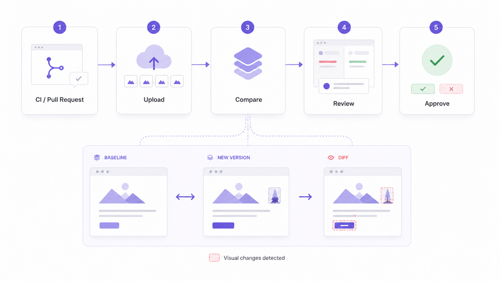

# Overview

### What is Argos?

Argos helps teams catch visual regressions before they reach production.

It works with your existing tools, such as Playwright, Storybook, Cypress, or any custom screenshot pipeline. Your CI uploads screenshots to Argos, then Argos compares them against a baseline and lets you review visual changes as part of your pull request workflow.

### How it works

<figure><figcaption></figcaption></figure>

1. **Your tests capture** screenshots in CI
2. **Your CI uploads** the screenshots to Argos
3. **Argos compares** them against the baseline
4. **You review** visual diffs on pull requests
5. **You approve** expected changes or request fixes
6. **Argos updates** the pull request check

### When to use Argos

Use Argos when visual changes can affect product quality or release confidence:

* **UI regressions:** broken layouts, CSS changes, missing images, icons, or fonts
* **Design systems:** component changes, theme changes, browser, viewport, or theme issues
* **Product variants:** white-labeled interfaces, translations, and localized layouts
* **AI generated UI:** visual validation before merging generated change

### Next steps

Ready to add Argos to your project? Start with the [Quickstart](quickstart/).

### Explore more

Once Argos is set up, you can learn more about advanced workflows:

* [baseline-build.md](learn/platform-fundamentals/baseline-build.md "mention")
* [deployments](learn/deployments/ "mention")
* [integrations](learn/integrations/ "mention")
* [flaky-test-detection.md](learn/reliability-and-flakiness/flaky-test-detection.md "mention")
