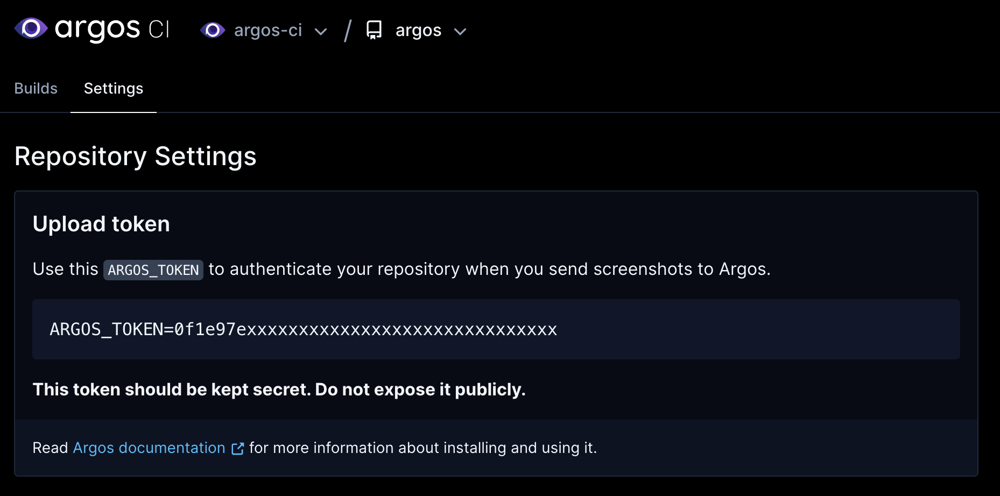

Argos uses a token called `ARGOS_TOKEN` to ensure only you can send screenshots. This token is secret and should not be visible publicly.

### Get the `ARGOS_TOKEN` of your repository

Login in [Argos](https://app.argos-ci.com) and go to your repository settings to copy your `ARGOS_TOKEN`.

