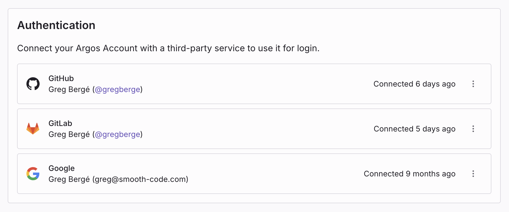
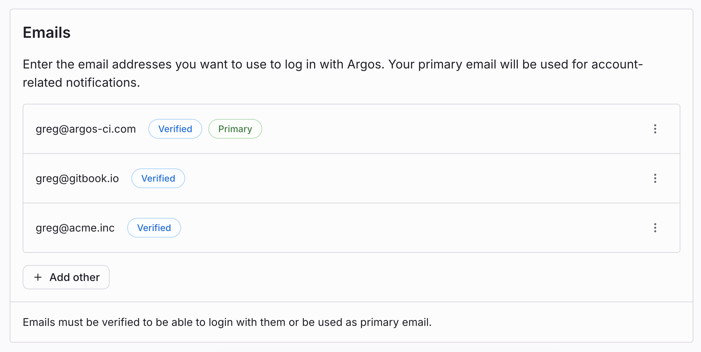
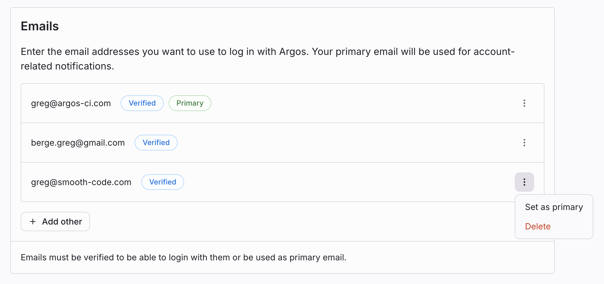

# Account Management

When you sign up for Argos, you create an account that manages your projects and subscriptions.  
Argos offers three types of plans:

- [Hobby](/pricing-plans#hobby-plan)
- [Pro](/pricing-plans#pro-plan)
- [Enterprise](/pricing-plans#enterprise-plan)

Each plan provides different features and resources to match your needs.

You can sign up with **Google**, **GitHub**, or **GitLab**.

---

## Signing up with a Git provider

Argos supports the following Git providers:

- [GitHub](/github)
- [GitLab](/gitlab)

When you sign up, you’ll be asked to authorize Argos to access your Git provider.  
This connection becomes your default login method.

After signing up, you can manage login methods in your **Personal Settings**.

---

## Login methods and connections

To manage login connections:

1. Select your profile picture in the top-right corner of the dashboard.
2. Choose **Personal Settings**.
3. Open the **Authentication** section.

### Logging in with SAML Single Sign-On (SSO)

SAML SSO allows Enterprise users to log in with their organization’s identity provider.  
Your team administrator must configure this option. To upgrade to Enterprise, [contact sales](/contact-us).

### Choosing a connection when creating a project

When you create your first project, you’ll be asked to connect a Git provider.  
This connection is required and will also serve as a login method.

---

## Teams

Teams let you collaborate on projects and share resources.

### Creating a team

1. Click the **scope selector** in the top-left of the navbar.
2. Choose **Create new team**.
3. Enter a team name.
4. By default, new teams start on the **Pro plan**. To switch plans, [contact us](/contact-us).

Team settings and members can be managed from the team’s settings page.

### Free Pro trial

Your first team automatically starts with a **14-day free trial of Argos Pro**.  
The trial includes unlimited users and **15,000 free screenshots**.

### Team membership

Owners can invite new members using an invitation link found in **Team Settings**.  
See [Roles and permissions](/team-members-and-roles#owner-role) for details.

### Leaving a team

You cannot leave a team if you are the **last owner** or the **last member**.

To leave a team:

1. If necessary, assign another owner first.
2. Go to your team’s **Settings** tab.
3. Scroll to **Leave Team** and select **Leave Team**.
4. Confirm the action.
5. If you are the last member, [delete the team](#deleting-a-team) instead.

### Deleting a team

1. Remove all team projects.
2. Open the team’s **Settings** tab.
3. Scroll to **Delete Team** and select **Delete Team**.
4. Confirm the action.

---

## Managing emails

To access email settings:

1. Select your avatar in the top-right corner.
2. Choose **Personal Settings**.
3. Open the **Emails** section.
4. From here, you can [add](#adding-a-new-email-address), [remove](#removing-an-email-address), or [change](#changing-your-primary-email-address) your primary email.

## Adding a new email address

1. In the **Emails** section, click **Add Another**.
2. Verify the new address using the link sent to your inbox.
3. Once verified, any email address on your account can be used to log in.

Limits:

- Up to **3 emails** per account.
- A maximum of **2 emails per domain**.

## Changing your primary email address

Your primary email is used for Argos notifications.

To change it:

- Add and verify a new email.
- Open the dot menu next to the address and choose **Set as Primary**.

## Removing an email address

To remove an address, use the **Delete** option in the dot menu.

> Note: You must set a new primary email before removing the current one.
