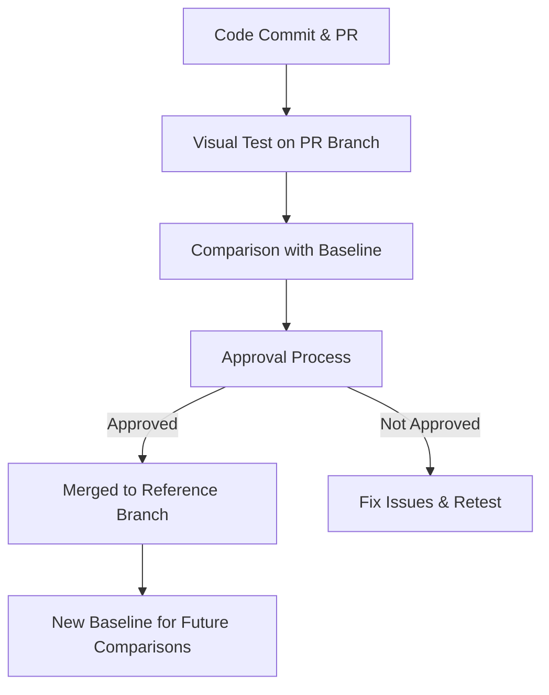
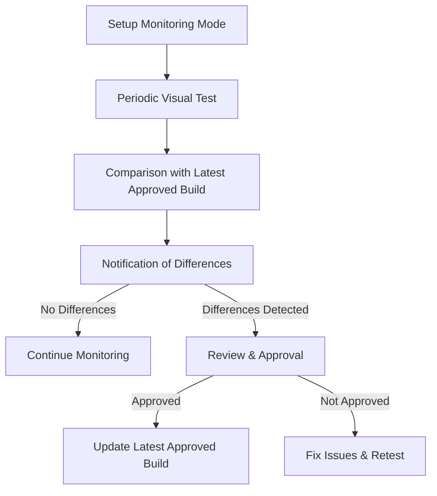

import { RunPkgCommand } from "@site/src/partials";

# Monitoring mode

Argos offers two modes for visual testing: Continuous Integration (CI) mode and Monitoring mode. This documentation explains how to use Monitoring mode to periodically monitor visual changes or perform checks before releases.

## Build modes

### Continous Integration Mode

The Continuous Integration (CI) mode is the default mode in Argos, designed to prevent visual regressions by integrating visual testing into your CI pipeline. In CI mode, Argos typically runs on each pull request and on the default branch of your repository.

In this mode, screenshots from your pull request branch are compared with baseline screenshots from the reference branch. Argos determines the appropriate build for comparison by analyzing your Git history and identifying the common ancestor between your code and the reference branch, ensuring only relevant differences are highlighted. To establish baseline builds, Argos must be run on your reference branch (usually "main"). Approval or rejection of a build does not affect the reference; only the merged code and uploaded screenshots from the reference branch are considered. **If unexpected changes are detected by Argos, avoid merging the pull request.** If merged, these discrepancies become the new reference.

#### Workflow

1. **Code Commit & Pull Request**

- Developer commits code to a feature branch.
- A pull request (PR) is created.

2. **Visual Test on PR Branch**

- Argos runs visual tests on the PR branch.
- Screenshots are taken on the PR branch.

3. **Comparison with Baseline**

- Argos compares screenshots from the PR branch with baseline screenshots from the reference branch (e.g., "main").
- The common ancestor between the PR branch and the reference branch is used to find the baseline.

4. **Approval Process**

- If visual differences are found, the PR is reviewed.
- Changes must be approved before merging.
- If merged, new screenshots from the reference branch become the baseline for future comparisons.



### Monitoring Mode

Monitoring mode is an opt-in feature in Argos, designed to keep track of visual changes over time or before a release. This mode typically runs periodically on a specific branch.

In Monitoring mode, screenshots are compared with the latest approved build, **ignoring all Git history**. Only the approval status of the build determines the baseline for comparison.

#### Workflow

1. **Setup Monitoring Mode**

- Monitoring mode is enabled for periodic checks or pre-release validation.

2. **Periodic Visual Test**

- Argos runs visual tests periodically on a specific branch or before a release.
- Screenshots are taken during each run.

3. **Comparison with Latest Approved Build**

- Argos compares screenshots with the latest approved build.
- Git history is ignored; only the approval status of the build matters.

4. **Notification of Differences**

- If visual differences are detected, notifications are sent.
- The project is reviewed, and changes are either approved or corrected.



## Use Cases for Monitoring Mode

Monitoring mode in Argos is designed to provide continuous oversight of visual changes in your project, especially outside the typical CI/CD pipeline scenarios. Here are some common use cases where Monitoring mode proves beneficial:

### 1. Regular Visual Health Checks

- **Scenario:** You have a live project that undergoes frequent updates, either content or minor style changes, which do not warrant a full CI pipeline run.
- **Solution:** Set up Monitoring mode to run periodically (e.g., daily or weekly) on your main branch. This ensures that any unexpected visual changes are detected early, even if they are not linked to specific code commits.

### 2. Pre-release Validation

- **Scenario:** Before rolling out a major release, you want to ensure that all visual aspects of your application are intact and there are no regressions.
- **Solution:** Use Monitoring mode to run a visual check on the release branch. This allows you to compare the current state with the last approved build, ensuring that everything looks as expected before the final deployment.

### 3. Post-deployment Monitoring

- **Scenario:** After deploying to a staging or production environment, you want to continuously monitor the visual integrity of your application to catch any discrepancies caused by environmental differences.
- **Solution:** Configure Monitoring mode to run after each deployment to these environments. This helps in identifying any issues that might not be evident in the development or CI environments but manifest in staging or production.

### 4. Third-party Integrations

- **Scenario:** Your application integrates with third-party services or widgets that may update independently.
- **Solution:** Set up Monitoring mode to regularly check the visual integration points of these third-party services to ensure they remain consistent and do not disrupt the user experience.

By leveraging Monitoring mode in these scenarios, you can maintain high visual standards for your application and catch issues early, ensuring a seamless experience for your users.

## Using monitoring mode

To use Monitoring mode, set the `mode` to `"monitoring"` in the build options of your SDK.

**Using CLI**

<RunPkgCommand
  command={["argos upload --mode=monitoring components ./screenshots"]}
/>

**Using Playwright**

```ts title="playwright.config.ts"
import { defineConfig } from "@playwright/test";

export default defineConfig({
  reporter: [
    process.env.CI ? ["dot"] : ["list"],
    [
      "@argos-ci/playwright/reporter",
      {
        uploadToArgos: !!process.env.CI,
        token: "<YOUR-ARGOS-TOKEN>",
        // highlight-next-line
        mode: "monitoring",
      },
    ],
  ],
  // Other config
});
```

**Using Cypress**

```js cypress.config.js
const { defineConfig } = require("cypress");
const { registerArgosTask } = require("@argos-ci/cypress/task");

module.exports = defineConfig({
  e2e: {
    async setupNodeEvents(on, config) {
      registerArgosTask(on, config, {
        uploadToArgos: !!process.env.CI,
        token: "<YOUR-ARGOS-TOKEN>",
        // highlight-next-line
        mode: "monitoring",
      });

      // include any other plugin code...
    },
  },
});
```
