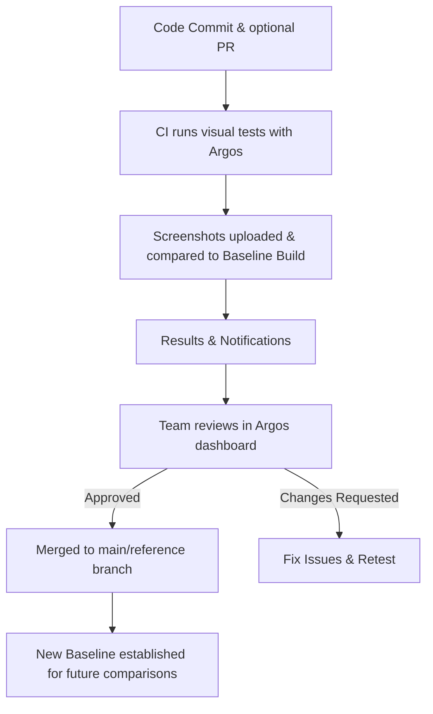
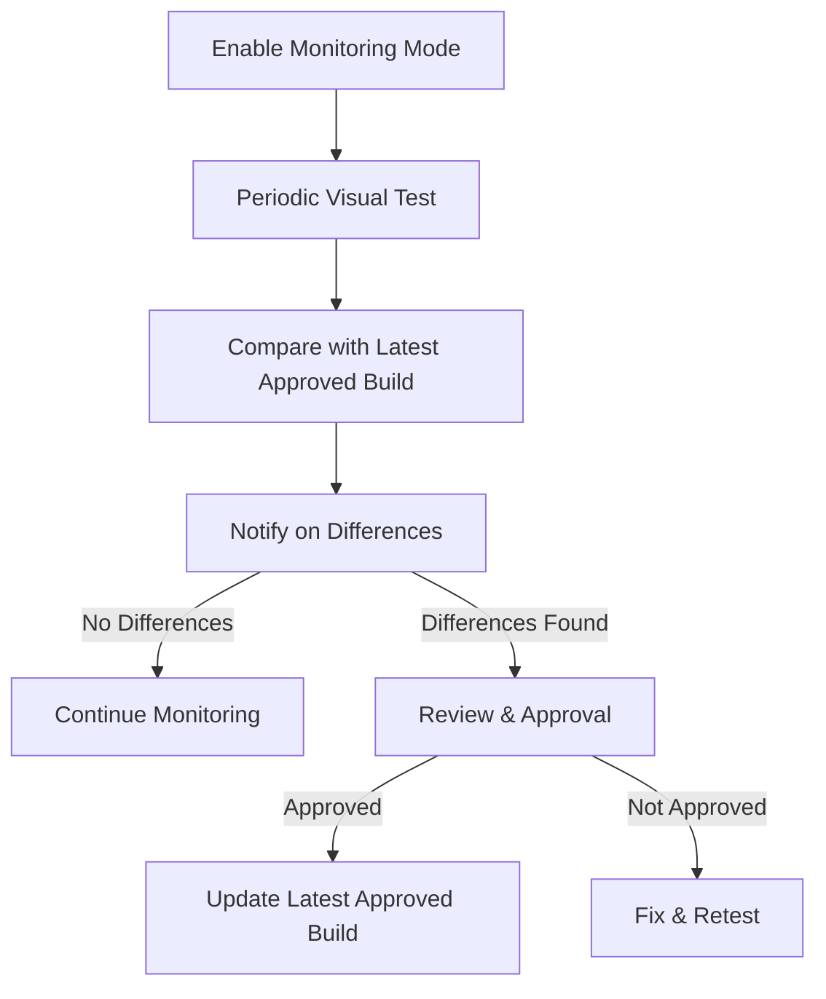

import { RunPkgCommand } from "@site/src/partials";

# Build modes

Argos provides two build modes for visual testing: **Continuous Integration (CI) mode** and **Monitoring mode**. This page explains how each mode works, their key differences, and when to use them to best fit your workflow.

## Continous Integration Mode

The Continuous Integration (CI) mode is the default mode in Argos, designed to prevent visual regressions by integrating visual testing into your CI pipeline. In CI mode, Argos typically runs on each pull request and on the default branch of your repository.

In this mode, screenshots from your pull request branch are compared with screenshots from a [baseline build](/baseline-build) determined by Git history analysis and [other criterias](/baseline-build).

### Workflow

1. **Feature Development**

- A developer commits code to a feature or bugfix branch.
- Optionally, a pull request (PR) is opened for review.

2. **Visual Tests on the Feature Branch**

- Argos integrates with your test framework [via SDKs](/getting-started).
- During CI, your test framework runs visual tests.
- Screenshots are captured and uploaded to Argos.

3. **Baseline Comparison**

- Argos determines the [baseline build](/baseline-build) from Git history and other criteria.
- New screenshots are compared against the baseline.

4. **Results & Notifications**

- When the build completes:
  - ✅ No differences → commit status set to _success_.
  - ❌ Differences found → commit status set to _failed_, with diffs visible in the Argos dashboard.
- On GitHub, Argos also posts a summary comment with a link to the dashboard.

5. **Approval Process**

- The team reviews differences in the Argos dashboard.
- Changes are either approved or rejected.
- The commit status updates accordingly.
- If branch protection requires passing visual tests, the PR cannot be merged until approvals are granted.



### Notifications

In CI mode, Argos integrates directly with your Git provider to surface results where developers work:

- **Commit status updates**: Each build sets the commit status to ✅ success or ❌ failed.
- **Pull request comments**: On GitHub, Argos posts a summary comment with a link to the Argos dashboard.
- **Slack notifications**: For faster team awareness, you can enable [Slack notifications](/slack-notifications). This ensures your team is notified immediately when visual differences are detected.

### Use Cases

CI mode is designed to be the primary workflow for preventing regressions during development. Typical scenarios include:

#### 1. Pull Request Validation

- **When:** A developer opens a PR with UI changes.
- **How:** Argos runs during CI, compares screenshots with the baseline, and blocks merging until visual changes are reviewed and approved.

#### 2. Default Branch Verification

- **When:** Code is merged into the main/reference branch.
- **How:** Argos runs on the default branch to ensure the new baseline is validated and ready for future comparisons.

#### 3. Continuous Feedback Loop

- **When:** Teams want fast feedback on every commit.
- **How:** CI mode surfaces results directly in GitHub, ensuring regressions are caught early in the workflow.

### Usage

CI mode is enabled by default.

Follow the [Get Started guide](/getting-started) to integrate Argos into your CI pipeline.

## Monitoring Mode

Monitoring mode is an **opt-in feature** in Argos that tracks visual changes outside the standard CI flow. It runs periodically on a chosen branch or before a release, providing continuous oversight of your project’s visuals.

In this mode, screenshots are compared against the **latest approved build only**. Git history is ignored; the approval status alone defines the baseline.

### Workflow

1. **Enable Monitoring Mode**

- Activate monitoring for periodic checks or pre-release validation.

2. **Run Periodic Visual Tests**

- Argos captures screenshots on the target branch (e.g., daily, weekly, or before a release).

3. **Compare with Latest Approved Build**

- Screenshots are compared only with the most recently approved build.

4. **Notify on Differences**

- If differences are found, notifications are sent.
- Changes must then be reviewed, approved, or corrected.



### Notifications

The most effective way to use Monitoring mode is to enable [**Slack notifications**](/slack-notifications).  
This ensures your team is alerted immediately when visual differences are detected, so you can review and act quickly.

### Use Cases

Monitoring mode is useful when you need visual oversight beyond standard CI/CD pipelines:

#### 1. Regular Health Checks

- **When:** Your live project changes often (content or style tweaks) but doesn’t justify running CI each time.
- **How:** Schedule monitoring on the main branch (e.g., daily/weekly) to catch unexpected changes early.

#### 2. Pre-release Validation

- **When:** Before a major release, you need to confirm no regressions slipped in.
- **How:** Run monitoring on the release branch and compare with the last approved build before deployment.

#### 3. Post-deployment Monitoring

- **When:** After staging or production deployments, you want to detect environment-specific visual issues.
- **How:** Run monitoring after each deployment to catch discrepancies not visible in development.

#### 4. Third-party Integrations

- **When:** Your app depends on external widgets or services that can change independently.
- **How:** Use monitoring to ensure third-party visuals remain stable over time.

### Usage

Enable Monitoring mode by setting `mode: "monitoring"` in your SDK configuration.

**CLI**

<RunPkgCommand
  command={["argos upload --mode=monitoring components ./screenshots"]}
/>

**Playwright**

```ts title="playwright.config.ts"
import { defineConfig } from "@playwright/test";

export default defineConfig({
  reporter: [
    process.env.CI ? ["dot"] : ["list"],
    [
      "@argos-ci/playwright/reporter",
      {
        uploadToArgos: !!process.env.CI,
        token: "<YOUR-ARGOS-TOKEN>",
        // highlight-next-line
        mode: "monitoring",
      },
    ],
  ],
});
```

**Cypress**

```js cypress.config.js
const { defineConfig } = require("cypress");
const { registerArgosTask } = require("@argos-ci/cypress/task");

module.exports = defineConfig({
  e2e: {
    async setupNodeEvents(on, config) {
      registerArgosTask(on, config, {
        uploadToArgos: !!process.env.CI,
        token: "<YOUR-ARGOS-TOKEN>",
        // highlight-next-line
        mode: "monitoring",
      });
    },
  },
});
```
