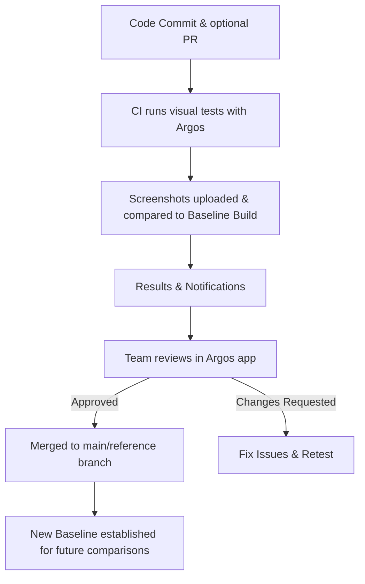

import { RunPkgCommand } from "@site/src/partials";

# Build modes

Argos provides two build modes for visual testing: **Continuous Integration (CI) mode** and **Monitoring mode**. This page explains how each mode works, their key differences, and when to use them to best fit your workflow.

## Continuous Integration Mode

Continuous Integration (CI) mode is the default in Argos. It is designed to review the visual changes introduced by a feature branch and prevent regressions.

During your CI pipeline, screenshots of the application are captured on each pull request and on the default branch (main, production, etc.). These screenshots are uploaded to Argos, where they are compared against a [baseline build](/baseline-build).

The [baseline build](/baseline-build) represents the most recent approved state of your application and is automatically selected based on Git history analysis and [other criteria](/baseline-build).

In the Argos app, you can review highlighted differences, approve intended updates, and block regressions before merging.

**Note:** Your CI pipeline must also run on the default branch (main, production, etc.) to keep the baseline build up to date.

### Workflow

1. **Feature Development**
   - A developer creates a feature (or bugfix) branch and commits changes.
   - Optionally, a pull request (PR) is opened.

2. **Visual Tests in CI**
   - During these tests, your test framework (Playwright, Cypress, etc.) captures screenshots of the app. Argos offers [SDKs](/getting-started) for easy integration with popular frameworks.
   - At the end of the tests, screenshots are uploaded to Argos automatically with the SDK, or manually using the Argos CLI.

3. **Comparison with Baseline**
   - Argos receives the build containing screenshots and metadata.
   - It automatically determines the [baseline build](/baseline-build) using Git history analysis and other criteria.
   - The new screenshots are compared against the baseline.

4. **Results & Notifications**
   - The build is complete once all screenshots have been compared:
     - ✅ No differences → commit status set to _success_.
     - ❌ Differences found → commit status set to _failed_. The changes are visible in the Argos app for review and approval.
   - Argos notifies the Git providers (GitHub, GitLab, etc.) about the build status.
   - On GitHub, Argos also posts a summary comment with a link to the dashboard.
   - On Git providers, if branch protection rules require Argos checks to pass, pull requests will be blocked from merging until all visual changes are reviewed and approved in Argos.

5. **Approval Process**
   - The team reviews the changes in the Argos app:
     - Each screenshot change can be approved or rejected.
     - The build as a whole must then be approved or rejected. The check status on Git providers (GitHub, GitLab, etc.) is automatically updated accordingly.



### Notifications

In CI mode, Argos integrates directly with your Git provider to surface results where developers work:

- **Commit status updates**: Each build sets the commit status to ✅ success or ❌ failed.
- **Pull request comments**: On GitHub, Argos posts a summary comment with a link to the Argos dashboard.
- **Slack notifications**: Enable [Slack notifications](/slack) to alert your team immediately when visual differences are detected.

### Use Cases

CI mode is designed to be the primary workflow for preventing regressions during development. Common scenarios include:

#### 1. Pull Request Validation

- **When:** A developer opens a PR with UI changes.
- **How:** Argos runs during CI, compares screenshots with the baseline, and blocks merging until visual changes are reviewed and approved.

#### 2. Default Branch Verification

- **When:** Code is merged into the main/reference branch.
- **How:** Argos runs on the default branch to ensure the new baseline is validated and ready for future comparisons.

#### 3. Continuous Feedback Loop

- **When:** Teams want fast feedback on every commit.
- **How:** CI mode surfaces results directly in GitHub, ensuring regressions are caught early in the workflow.

### Usage

CI mode is enabled by default.

Follow the [Get Started guide](/getting-started) to integrate Argos into your CI pipeline.

## Monitoring Mode

Monitoring mode is an **opt-in feature** in Argos. It is designed to track visual changes outside the standard CI flow, either on a schedule or before a release.

In this mode, your tests capture screenshots on the chosen branch (e.g., main or a release branch). The screenshots are uploaded to Argos and compared only against the **latest approved build**. Git history is ignored. The approval status alone defines the baseline.

### Workflow

1. **Enable Monitoring Mode**

- Activate monitoring for periodic checks or pre-release validation.

2. **Run Periodic Visual Tests**

- Your tests capture screenshots on the target branch (daily, weekly, or before a release).

3. **Compare with Latest Approved Build**

- Screenshots are compared only with the most recently approved build.

4. **Notify on Differences**

- If differences are found, notifications are sent.
- Changes must then be reviewed, approved, or corrected.


### Notifications

[Set up **Slack notifications**](/slack#set-up-slack-notifications) to be alerted immediately when visual differences are detected, so your team can review and act quickly.

### Use Cases

Monitoring mode is useful when you need oversight beyond standard CI/CD pipelines:

#### 1. Regular Health Checks

- **When:** Your project changes frequently (content or style tweaks) but running CI on every change isn't practical.
- **How:** Schedule monitoring on the main branch (e.g., daily/weekly) to catch unexpected changes early.

#### 2. Pre-release Validation

- **When:** Before a major release, you need to confirm no regressions slipped in.
- **How:** Run monitoring on the release branch and compare with the last approved build before deployment.

#### 3. Post-deployment Monitoring

- **When:** After staging or production deployments, you want to detect environment-specific visual issues.
- **How:** Run monitoring after each deployment to catch discrepancies not visible in development.

#### 4. Third-party Integrations

- **When:** Your app depends on external widgets or services that can change independently.
- **How:** Use monitoring to ensure third-party visuals remain stable over time.

### Usage

Enable Monitoring mode by setting `mode: "monitoring"` in your SDK configuration.

**CLI**

<RunPkgCommand
  command={["argos upload --mode=monitoring components ./screenshots"]}
/>

**Playwright**

```ts title="playwright.config.ts"
import { defineConfig } from "@playwright/test";

export default defineConfig({
  reporter: [
    process.env.CI ? ["dot"] : ["list"],
    [
      "@argos-ci/playwright/reporter",
      {
        uploadToArgos: !!process.env.CI,
        token: "<YOUR-ARGOS-TOKEN>",
        // highlight-next-line
        mode: "monitoring",
      },
    ],
  ],
});
```

**Cypress**

```js cypress.config.js
const { defineConfig } = require("cypress");
const { registerArgosTask } = require("@argos-ci/cypress/task");

module.exports = defineConfig({
  e2e: {
    async setupNodeEvents(on, config) {
      registerArgosTask(on, config, {
        uploadToArgos: !!process.env.CI,
        token: "<YOUR-ARGOS-TOKEN>",
        // highlight-next-line
        mode: "monitoring",
      });
    },
  },
});
```
