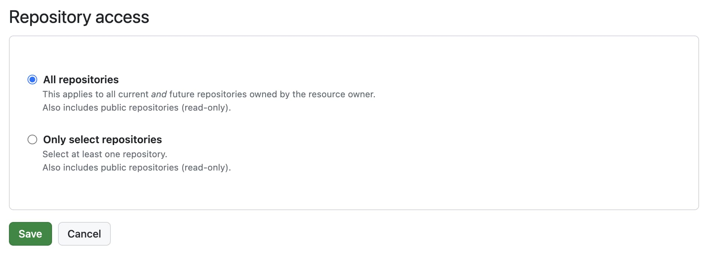

# GitHub Integration

Seamlessly integrate Argos with GitHub for automated visual testing directly within your workflow. Connect Argos to your repositories and receive instant feedback on your pull requests, making it easier to maintain visual consistency across your project.

## Why Argos needs repository access

Argos analyzes commit history to choose the right [baseline build](/baseline-build) and posts commit statuses or pull request comments. Granting repository access lets Argos read commits, find merge bases, and report build results back to GitHub.

## GitHub Connect

Use GitHub Connect to log in to Argos with your GitHub account. This integration allows Argos to access your repositories and streamline the setup process.

## Argos' GitHub App

Argos provides a dedicated GitHub App that connects directly to your repositories, enabling real-time visual testing feedback on pull requests.

### Install the Argos GitHub App

1. Visit the [Argos app page on GitHub](https://github.com/apps/argos-ci)
2. Click on "Configure" and select the organization where you want to install Argos
3. Follow the prompts to complete the installation

### Import a GitHub Repository to Argos

1. Sign in to Argos and click on "Create a new project"
2. Choose GitHub as your provider, then click "Import your repository"

### Update the Repositories Shared with Argos

1. Go to the [Argos app page on GitHub](https://github.com/apps/argos-ci) and click "Configure"
2. Select the organization where you want to manage repository access
3. Under "Repository access," choose "Only select repositories" and select the specific repositories you wish to share with Argos

## Required GitHub App permissions

Argos needs the following permissions to operate:

- **Contents** — used to find a common commit ancestor between branches
- **Statuses** — used to add statuses to commits
- **Pull requests** — used to add comments in pull requests
- **Actions** — used to allow tokenless authentication

We take your security and privacy seriously. If you have any concerns or questions, please [contact us](/contact-us).

## GitHub Integration without Content Permission

If you prefer to use Argos without granting full content access to your repositories, you can now integrate via a more restricted setup.

### Setting Up Argos with Limited GitHub Access

1. From the dashboard, select your team from the scope selector
2. Select the **Settings** tab and go to the **Integrations** section
3. Scroll to "GitHub without content access"
4. Click **Install GitHub App**

3. On the next screen you are redirected to GitHub, choose the specific repositories where you want to install the Argos app

4. Select **Projects** tab
5. Click **Create a new project** at the top right
6. Select **Continue with GitHub (no-content access)**

7. Choose the repository you want to connect
