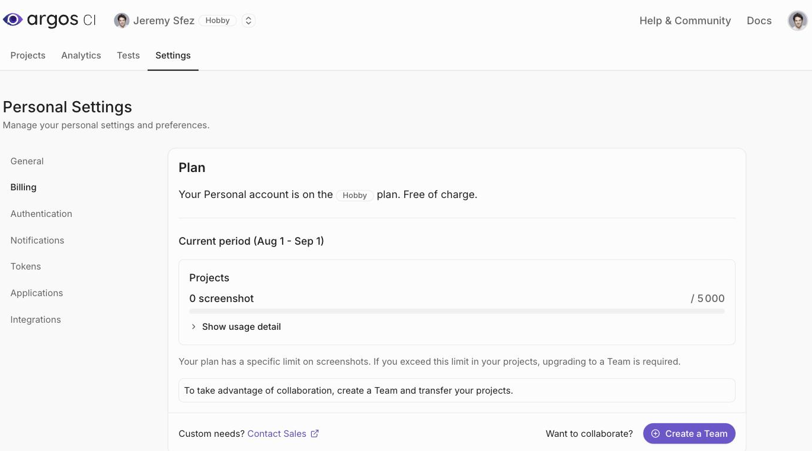
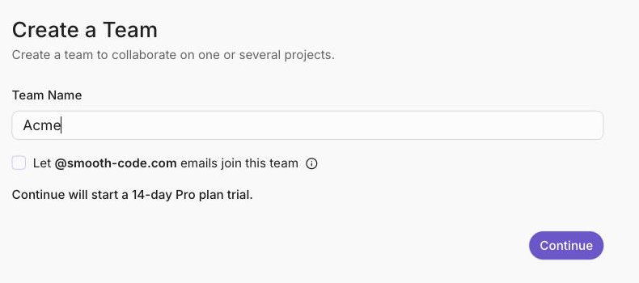
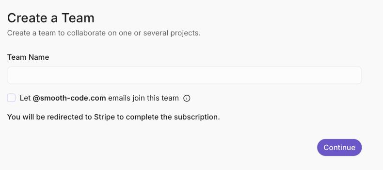
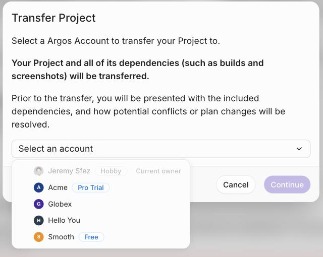
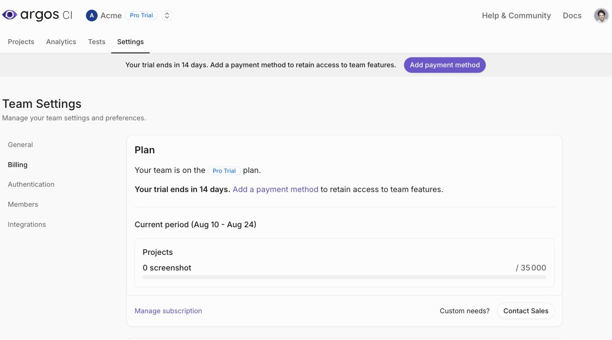

# How to subscribe

Paid plans belong to **teams**, not to personal accounts. A personal account stays on the free [Hobby plan](pricing-plans.md) forever, so upgrading means creating a team on the Pro plan and transferring your projects to it.


Your first team starts on a **14-day Pro trial**, with no credit card required. If you have already used your trial, you go straight to Stripe Checkout instead.


### Upgrade a Hobby account to a Pro team



### Create a team

From your personal account, go to **Settings → Billing** and select **Create a Team**.




### Name the team and continue

Enter a team name, then select **Continue**. The line above the button tells you what happens next.

If you have never used the Pro trial, the team is created immediately on a 14-day trial — no payment details are asked for.

If you have already used your trial, you are redirected to Stripe Checkout to complete the subscription before the team becomes usable.


The optional **Let @your-domain emails join this team** checkbox only appears if you have a verified company email address. It can be changed later in the team settings.




### Transfer your projects

Your existing projects stay on your personal account until you move them. For each project, go to **Settings → Transfer Project**, select **Transfer**, then pick the new team.

The next screen lists the builds and screenshots that will move, and confirms the plan change, before you select **Transfer**.



### Add a payment method

During the trial, the team's **Settings → Billing** page shows how many days are left. Select **Add a payment method** to open the Stripe portal and enter your card — without it, the team loses access to team features when the trial ends.





The Pro plan is usage-based: the first payment is taken at the end of the billing period, based on the screenshots you actually used. See [Usage & spend management](spend-management.md).


### Subscribe through GitHub Marketplace

To pay through your GitHub invoice instead of a card, start the subscription from the [Argos page on GitHub Marketplace](https://github.com/marketplace/argos-ci). Make sure you upgrade the correct organization.


GitHub does not allow **invoiced GitHub accounts** to purchase paid plans on the Marketplace. If you see the error "Unfortunately, invoiced customers cannot purchase paid plans on the GitHub Marketplace", subscribe through Stripe instead.


### Subscribe a team whose trial has expired

If a team's trial has expired or its subscription was canceled, a banner at the top of the team pages offers a **Subscribe** button, which opens Stripe Checkout. A team that has never extended its trial also gets an **Extend trial** button there.

### Manage your subscription

To view invoices, update your payment method, or cancel your plan, go to the team's **Settings → Billing** and select **Manage subscription**.

You are redirected to your payment provider — the Stripe customer portal, or GitHub Marketplace if you subscribed there.

### Next steps

* [Pricing plans](pricing-plans.md) – Compare what each plan includes
* [Usage & spend management](spend-management.md) – Track usage and set spend limits
