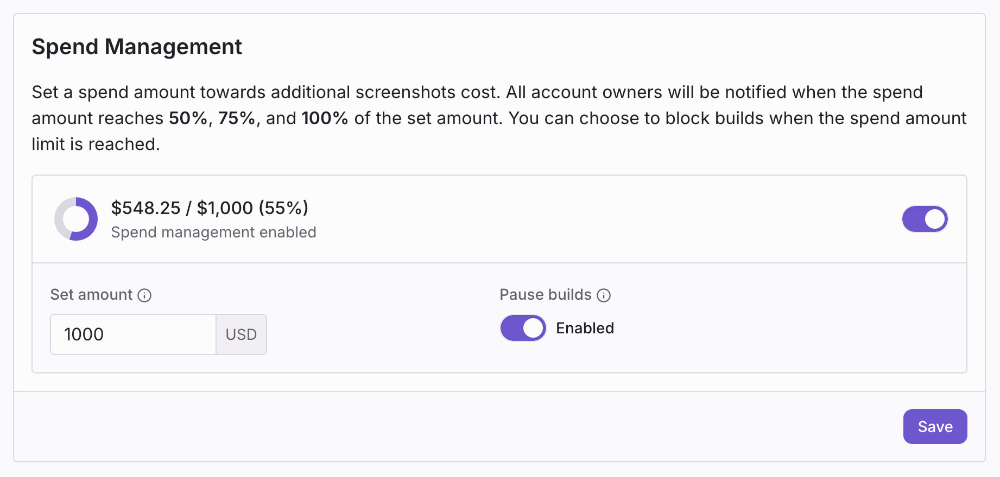

# Spend Management

Learn how to get notified about you team's spend and block further usage when you reach your budget.

:::note

Spend management is available on Pro and Enterprise plans (usage based)

:::

Spend management is a way for you to notify or to automatically take action on your account when your team hits a set spend amount. The actions you can take are:

- [Receive a notification](#alert-threshold-notifications) when you reach certain thresholds of your spend amount
- [Pause the builds on all your projects](#pausing-projects)

:::warning

Setting a spend amount does not automatically stop usage. If you want to pause all your projects at a certain amount, you must [enable the option](#pausing-projects).

:::

The spend amount is set per billing cycle.

Setting the amount halfway through a billing cycle considers your current spend. You can increase or decrease your spend amount as needed. If you configure it below the current monthly spend, Spend Management will trigger any configured actions (including pausing all projects).

## What does Spend Management include?

The spend amount that you set covers additional screenshots that go beyond your plan usage for all projects on your team.

It does not include separate **add-ons**, which Argos charges per billing period.

### How Argos checks your spend amount

ercel checks your additional screenshots usage often to determine if you are approaching or have exceeded your spend amount. This check happens at every build processed by Argos.

## Managing your spend amount

To enable spend management, you must have an **Owner** role on your team.

1. From the dashboard, select your team from the scope selector
2. Select the **Settings** tab and go to the **Billings** section
3. Scroll to **Spend Management** and enable the switch:

4. Set your spend amount at which you want to be notified or take action
5. Choose to [pause all projects](#pausing-projects) when you reach your spend amount

## Alert threshold notifications

When you set a spend amount, Argos will send an email to all your team owner members when spending on your team reaches **50%**, **75%**, and **100%** of the spend amount.

It's not currently possible to customize the alert threshold notifications.

## Pausing projects

Argos provides an option to automatically pause the builds for all of your projects when your spend amount is reached. This option is on by default.

1. In the **Spend Management** section of your team's settings, enable and set your **[spend amount](#managing-your-spend-amount)**
2. Ensure the **Pause builds** switch is **Enabled**
3. Confirm the action by entering the team slug and select **Continue**.
4. When your team reaches the spend amount, Argos automatically pauses the builds for all projects on your team

When you try to create a new build, you will get an error message that the builds are paused due to reaching the spend amount. **It will make your CI builds fail until you increase your spend amount or disable the pause builds option.**

### Unpausing projects

To unpause your projects, you must increase your spend amount or disable the pause builds option.
