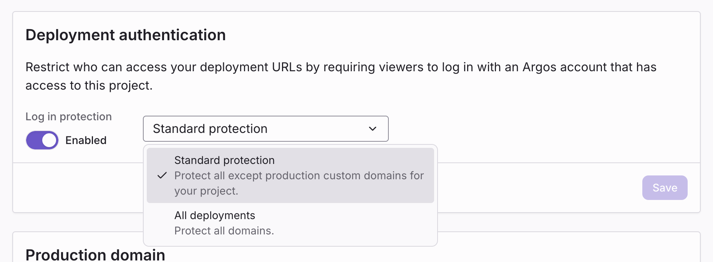

# Access protection

By default, deployment URLs are reachable by anyone who has the link. For most internal projects, that's not what you want—a Storybook can leak unreleased designs, copy, or features. Argos lets you require viewers to sign in with an Argos account before opening any deployment URL.

Access protection is configured per project, and applies to every deployment under it.

## Protection modes

Argos supports three modes:

| Mode                    | Preview URLs      | Production domain | Available on |
| :---------------------- | :---------------- | :---------------- | :----------- |
| **Public**              | No login required | No login required | All plans    |
| **Standard protection** | Login required    | No login required | All plans    |
| **All deployments**     | Login required    | Login required    | Team plans   |

When login is required, only Argos users who have access to the project can open the deployment. Everyone else sees the Argos sign-in screen.

### Public

Everyone with the link can open the deployment. Use this if your project is fully public (for example, an open-source design system) or if the build is intentionally meant to be shared.

### Standard protection

Login required for every URL **except** the production domain. The production domain stays public; all preview URLs and the immutable deployment URLs require sign-in.

This is the right default for most teams: production is browsable by anyone (designers, customers, stakeholders), while previews stay private to your team.

### All deployments

Login required for **all** URLs, including the production domain. Use this when the production build itself contains sensitive material—for example, internal tools or a Storybook for unreleased features.

This option requires a Team plan.

## Configure access protection

1. Open your project in Argos.
2. Go to **Settings → Deployments**.
3. Toggle **Log in protection** and pick the level.

_Project Settings → Deployments → Deployment authentication._

Changes take effect immediately on the next request.

## Who can access protected deployments

When login protection is enabled, a viewer must:

1. Be signed in to Argos.
2. Have access to the project the deployment belongs to.

Project access follows the [team roles and permissions](/team-members-and-roles) rules: team members, contributors invited to the project, and account owners.

A viewer who does not have access sees a 404-style screen rather than a sign-in prompt, so the existence of the project is not disclosed.

## Related

- [Deployments overview](/deployments)
- [URLs and domains](/deployments/urls)
