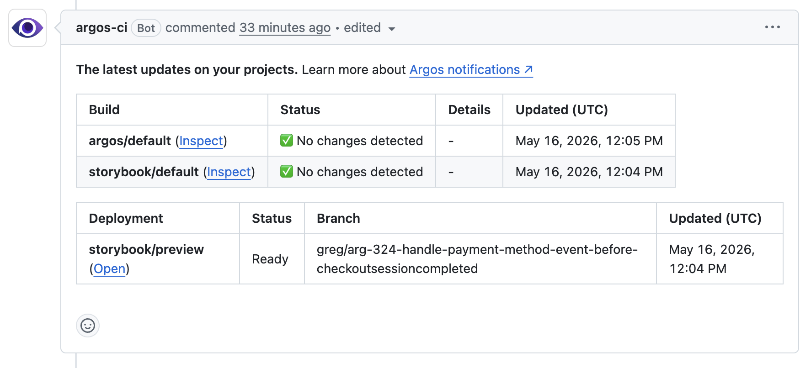

import { RunPkgCommand } from "@site/src/partials";

# Use deployments in CI

Running `argos deploy` from CI is the most common setup: a new deployment is created on every push to a pull request, and the deployment link appears in the PR comment alongside Argos visual tests.

This page walks through a GitHub Actions setup for Storybook. The same pattern works for any static build and any CI provider.

## Prerequisites

- A static build step that produces a directory (for Storybook: `npm run build-storybook` → `storybook-static/`).
- An `ARGOS_TOKEN` available as a CI secret. You can also use [GitHub OIDC](/github-oidc) or [tokenless authentication](/github-tokenless) to avoid managing a secret.

## GitHub Actions example

```yaml title=".github/workflows/argos-deploy.yml"
name: Deploy Storybook to Argos

on:
  pull_request:
  push:
    branches:
      - main

jobs:
  deploy:
    runs-on: ubuntu-latest
    steps:
      - uses: actions/checkout@v6
      - uses: actions/setup-node@v6
      - run: npm ci
      - run: npm run build-storybook
      - run: npx --no-install argos deploy ./storybook-static
        env:
          ARGOS_TOKEN: ${{ secrets.ARGOS_TOKEN }}
```

A few notes:

- The workflow listens to both `pull_request` and `push` to `main`. Pull request runs produce **preview** deployments; pushes to `main` produce **production** deployments (because `main` matches the default production branch pattern—see [Environments](/deployments/environments)).
- `actions/checkout` gives Argos the commit SHA and branch it needs to associate the deployment with the right pull request.
- The `ARGOS_TOKEN` is the project token from **Settings → General → Token**.

## Force a production deployment

If your production branch differs from your repository's default branch (or if you want to be explicit), pass the `--prod` flag:

```yaml
- run: npx --no-install argos deploy ./storybook-static --prod
  env:
    ARGOS_TOKEN: ${{ secrets.ARGOS_TOKEN }}
```

You can keep the same workflow for both preview and production by branching on the event:

```yaml
- name: Deploy
  run: |
    if [ "${{ github.event_name }}" = "push" ]; then
      npx --no-install argos deploy ./storybook-static --prod
    else
      npx --no-install argos deploy ./storybook-static
    fi
  env:
    ARGOS_TOKEN: ${{ secrets.ARGOS_TOKEN }}
```

## Combine with visual testing

The `deploy` and `upload` commands are independent: you can run both in the same workflow to get a deployment URL **and** Argos visual tests on the same commit.

```yaml
- run: npm run build-storybook
- run: npm run test:visual # Your usual Argos visual test job
  env:
    ARGOS_TOKEN: ${{ secrets.ARGOS_TOKEN }}
- run: npx --no-install argos deploy ./storybook-static
  env:
    ARGOS_TOKEN: ${{ secrets.ARGOS_TOKEN }}
```

Argos posts a single pull request comment that lists both the deployment URLs and the visual build results.


_GitHub pull request comment showing both the deployment and the Argos visual build._

## Status checks

Each deployment registers a commit status named `argos-deploy/<project>`. The status starts as **pending** when the upload begins and becomes **success** when the deployment is ready. You can require it in your branch protection rules if a missing deployment should block a merge.

## Other CI providers

The `argos deploy` command has no GitHub-specific behavior. To run it on another CI provider:

1. Build your static directory in your pipeline.
2. Set `ARGOS_TOKEN` as a secret.
3. Run `argos deploy <directory>` (add `--prod` for production).

Argos automatically detects the commit SHA, branch, and pull request number from the most common CI environment variables.

## Related

- [Deployments overview](/deployments)
- [Environments](/deployments/environments)
- [GitHub integration](/github)
- [Argos CLI reference](/argos-cli)
