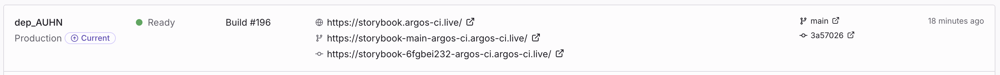
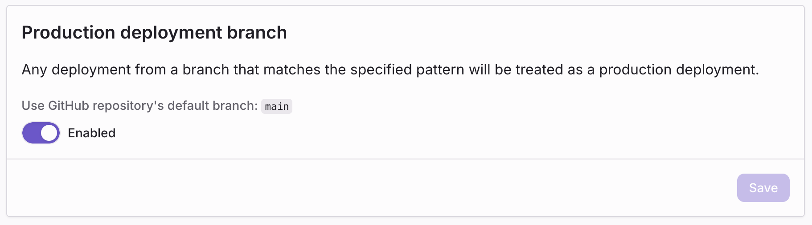

import { RunPkgCommand } from "@site/src/partials";

# Environments

Every deployment is created in one of two environments:

- **Preview** — A non-production deployment, typically created from a feature branch or pull request. Each preview gets its own URL and never replaces the production deployment.
- **Production** — The deployment served on your project's production domain. Only deployments from a production branch are promoted here.

The environment is decided when the deployment is created and cannot be changed afterwards.

## How the environment is determined

Argos picks the environment in this order:

1. **Explicit override.** If you pass `--prod` to the CLI (or `environment: "production"` to the SDK), the deployment is created as production.
2. **Branch match.** Otherwise, the branch name is matched against the project's **production branch pattern**. A match → production. No match → preview.

By default, the production branch pattern follows your Git repository's default branch (usually `main`). You can override it from project settings.

## Preview deployments

Preview deployments are the default. They are created when:

- You run `argos deploy <directory>` without `--prod`, **and**
- The branch does not match the production branch pattern.

Each preview deployment gets:

- A unique, immutable **deployment URL** — always points to that exact build.
- A **branch URL** — always points to the latest preview on that branch. Useful to share a link that follows a feature branch as it evolves.

See [URLs and domains](/deployments/urls) for the full list of URLs Argos generates.

When a preview deployment is linked to a pull request, the deployment status appears in the [pull request comment](/pull-request-comments) and as a commit status check on the PR.

## Production deployments

A production deployment is created when:

- You run `argos deploy <directory> --prod`, **or**
- The branch matches the production branch pattern.

When a new production deployment becomes ready, it is **promoted**: the project's production domain immediately starts serving the new build. Earlier production deployments remain available at their own URLs.

The Argos dashboard shows a **Current** badge next to the deployment that is currently serving the production domain.

_The deployments list highlights the deployment currently promoted to production._

## Configure the production branch

By default, Argos uses your Git repository's default branch as the production branch. You can customize this from **Settings → Deployments → Production deployment branch**.

_Project Settings → Deployments → Production deployment branch._

To customize:

1. Disable **Use GitHub repository's default branch**.
2. Enter a [glob pattern](https://github.com/isaacs/minimatch) that matches your production branches.

Examples:

- `main` — Only the `main` branch.
- `{main,production}` — Either `main` or `production`.
- `release/**` — Any branch under `release/` (for example `release/2024-q4`).

Any branch matching the pattern produces a production deployment on the next CLI run, even without `--prod`.

## Forcing an environment from the CLI

You can force the environment regardless of the branch with the `--prod` flag:

<RunPkgCommand command="argos deploy ./storybook-static --prod" />

This is useful when you want to:

- Deploy a one-off production build from a local machine.
- Promote a deployment from a non-standard branch (for example, a release branch that doesn't match the configured pattern).

There is currently no flag to force a preview from a production branch—simply do not pass `--prod` and adjust the production branch pattern if needed.

## Related

- [Deployments overview](/deployments)
- [URLs and domains](/deployments/urls)
- [Use deployments in CI](/deployments/ci)
