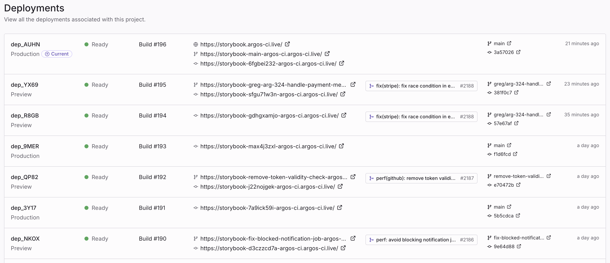

import { RunPkgCommand } from "@site/src/partials";

# Deployments

A **deployment** on Argos is a static build—most commonly a Storybook—served on a unique URL that you can open, share, and review. Every time you run the Argos CLI, Argos uploads your build, generates a URL, and posts the status back to your pull request.

Use deployments to:

- Preview a Storybook for every pull request, with no infrastructure of your own to maintain.
- Share a live link with designers, product, or stakeholders to review work in context.
- Browse the history of every deployed build across branches and commits.


_Deployments list in the Argos dashboard._

## How it works

A deployment is created in three phases:

1. **Build** — The Argos CLI scans your local directory and computes a content hash for every file.
2. **Upload** — Argos returns pre-signed upload URLs for the files it doesn't already have. Files that match an existing hash are skipped, so re-deploying an unchanged build is near-instant.
3. **Serve** — Once the upload finishes, Argos finalizes the deployment, assigns it a URL, and reports the status to your Git provider.

Each deployment is **immutable**. Re-running the deploy command always produces a new deployment with its own URL—the previous one keeps working.

## Quickstart

The following steps get a Storybook deployed in under a minute. The same flow works for any static directory (Vite build, Next.js export, plain HTML, etc.).

### 1. Install the Argos CLI

<RunPkgCommand command="npm install --save-dev @argos-ci/cli" />

### 2. Build your static site

Generate the directory you want to deploy. For Storybook:

```bash
npm run build-storybook
```

This produces a `storybook-static/` directory.

### 3. Deploy

<RunPkgCommand command="argos deploy ./storybook-static" />

The CLI uploads your build and prints a unique URL when the deployment is ready:

```
✔ Deployed: https://my-project-abcd123-acme.argos-ci.live
```

By default, the deployment is created in the **preview** environment. To deploy to **production**, add the `--prod` flag:

<RunPkgCommand command="argos deploy ./storybook-static --prod" />

See [Environments](/deployments/environments) for the rules that decide which environment a deployment lands in.

## Authentication

The deploy command uses the same authentication as the rest of the Argos CLI. Set the `ARGOS_TOKEN` environment variable in CI:

```bash
ARGOS_TOKEN=<your-project-token>
```

You can find the project token in **Settings → General → Token**. On GitHub Actions, you can also use [OIDC](/github-oidc) or [tokenless authentication](/github-tokenless) to avoid managing a secret.

## What's next

<div className="grid grid-cols-1 md:grid-cols-2 gap-4">

- [**Environments**](/deployments/environments) — How preview and production deployments are determined, and how to customize the production branch.
- [**URLs and domains**](/deployments/urls) — The URLs Argos generates for each deployment, and how to set the production domain.
- [**Access protection**](/deployments/authentication) — Restrict who can open deployment URLs.
- [**Use in CI**](/deployments/ci) — Deploy automatically on every pull request with GitHub Actions.

</div>
