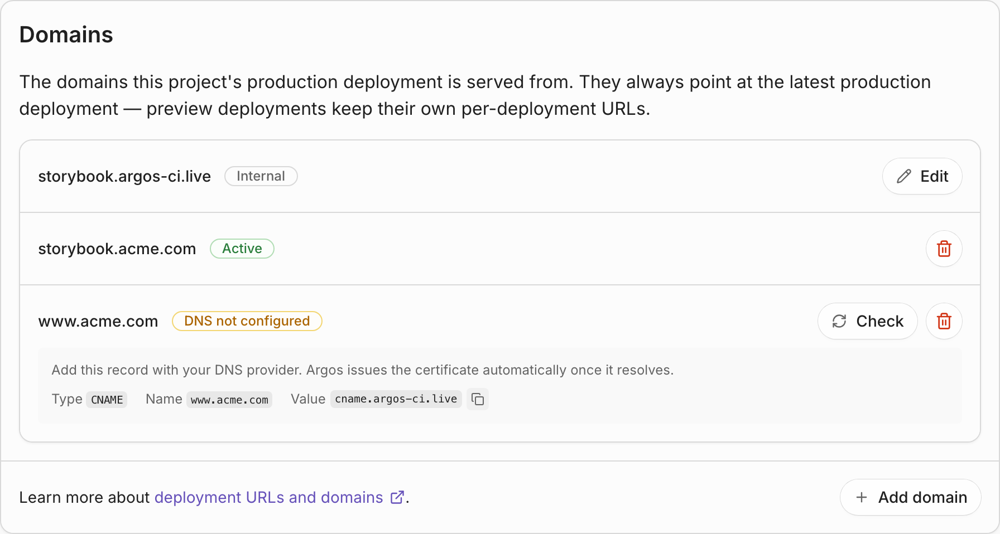
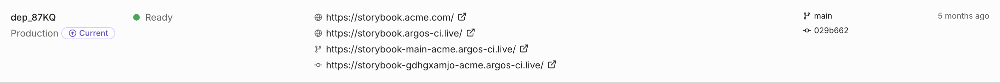

# URLs and domains

Every deployment is reachable through one or more URLs. The exact URLs depend on the deployment's environment and the project's configuration. Argos generates all of them under the shared root domain `argos-ci.live`, and production deployments can additionally be served from a [custom domain](#custom-domain) you own.

### Deployment URL

Every deployment has an **immutable deployment URL** that always points to that exact build. It looks like:

```
https://<project>-<random>-<account>.argos-ci.live
```

For example: `https://storybook-gdhgxamjo-acme.argos-ci.live`

The deployment URL never changes and never moves. It's the safest URL to share when you want a stable reference to a specific build—for example, in a pull request review or a bug report.

### Branch URL

In addition to the deployment URL, each deployment registers a **branch URL** that follows the latest deployment on that branch:

```
https://<project>-<branch>-<account>.argos-ci.live
```

For example, on a branch named `fix-stripe`: `https://storybook-fix-stripe-acme.argos-ci.live`

When you push a new commit on the same branch and re-deploy, the branch URL is updated to point at the new build. The previous deployment is still available at its own deployment URL.

Branch names containing characters that are not URL-safe are slugified.


Branch URLs are useful in pull request templates and review checklists: a reviewer can bookmark the same link and always see the latest version of a feature.


### Production domain

Production deployments are additionally served on the project's **production domain**:

```
https://<your-slug>.argos-ci.live
```

The production domain is shared across all production deployments. When a new production deployment is promoted, the domain immediately starts serving the new build—older production deployments stay reachable on their own deployment URLs.

#### Configure the production domain

The production domain slug defaults to your project name. To change it, go to **Settings → Deployments → Domains** and click **Edit** next to the domain ending in `argos-ci.live`.

<figure><figcaption><p><em>Project Settings → Deployments → Domains.</em></p></figcaption></figure>

Rules for the slug:

* Lowercase, up to 48 characters.
* Must start and end with an alphanumeric character.
* Dashes are allowed in the middle.

The final domain is `<slug>.argos-ci.live`.


Changing the production domain takes effect immediately. Any existing links that used the previous domain will stop resolving.


### Custom domain

Production deployments can also be served from a domain you own, such as `storybook.acme.com`. A custom domain behaves like the production domain—it always points at the latest production deployment—but it carries your own name instead of `argos-ci.live`.

Once a custom domain is live, Argos uses it in the links it publishes back to GitHub, so the commit status and the pull request comment point at your domain rather than at the generated URL.


Custom domains are included in paid plans and require a team. A personal account has no plan to upgrade—create a team and transfer the project to it first.



Custom domains serve **production deployments only**. Preview deployments keep their own deployment and branch URLs.


#### Add a custom domain



## Add the domain in Argos

Go to **Settings → Deployments → Domains**, click **Add domain**, and enter the fully qualified domain you want to use—for example `storybook.acme.com`. Enter the domain on its own, not a URL.



## Create the DNS record

Argos shows the record to create as soon as the domain is added. Add it with your DNS provider:

| Field | Value                                   |
| ----- | --------------------------------------- |
| Type  | `CNAME`                                 |
| Name  | Your domain, e.g. `storybook.acme.com`  |
| Value | `cname.argos-ci.live`                   |

Copy the value from the interface rather than typing it—Argos displays it with a copy button next to the domain.



## Wait for the certificate

Argos issues and installs a TLS certificate as soon as the record resolves. There is no second record to add and no certificate to upload.

Argos re-checks pending domains on its own. Click **Check** next to the domain if you want to verify right away instead of waiting.




**A root domain needs an ALIAS record.** Most DNS providers cannot put a `CNAME` on a root domain such as `example.com`. Use an `ALIAS` or `ANAME` record pointing at the same value, or point a subdomain at Argos instead. This is the most common reason a domain never leaves **DNS not configured**.


#### Domain status

Each custom domain shows where it is in the process:

| Status                  | Meaning                                                                                               |
| ----------------------- | ----------------------------------------------------------------------------------------------------- |
| **DNS not configured**  | Argos cannot resolve the domain to `cname.argos-ci.live` yet. Check the record with your DNS provider. |
| **Issuing certificate** | The record resolves and the certificate is being issued. Nothing to do.                               |
| **Active**              | The domain is live and serving the latest production deployment.                                      |
| **Failed**              | Something is blocking the domain. The reason is shown underneath it.                                   |

A domain most often **fails** because the hostname is already attached to another CDN distribution. A domain can only be served by one at a time, so it has to be released there before Argos can take it.

#### Remove a custom domain

Removing a domain from **Settings → Deployments → Domains** stops serving it straight away. Delete the DNS record as well, or it keeps pointing at Argos with nothing behind it.

### Summary

| URL type          | Stability                                              | When it exists                     |
| ----------------- | ------------------------------------------------------ | ---------------------------------- |
| Deployment URL    | Immutable — always points at one build                 | Every deployment                   |
| Branch URL        | Updates when a new deployment lands on the same branch | Every deployment                   |
| Production domain | Updates when a new production deployment is promoted   | Production deployments only        |
| Custom domain     | Updates when a new production deployment is promoted   | Production deployments, paid plans |

All URLs above appear in the **Deployments** tab of your project in Argos.

<figure><figcaption><p><em>A production deployment in the Deployments tab: custom domain first, then the production domain, the branch URL, and the deployment URL.</em></p></figcaption></figure>

### Related

* [Environments](environments.md) — How preview vs production is decided.
* [Access protection](access-protection.md) — Restrict who can open these URLs.
