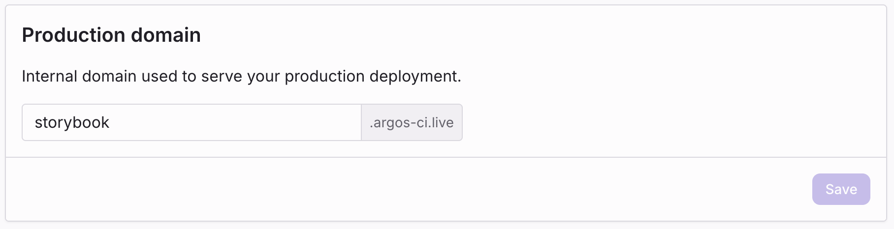
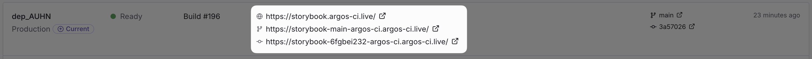

# URLs and domains

Every deployment is reachable through one or more URLs. The exact URLs depend on the deployment's environment and the project's configuration. All deployment URLs are served from the shared root domain `argos-ci.live`.

## Deployment URL

Every deployment has an **immutable deployment URL** that always points to that exact build. It looks like:

```
https://<project>-<random>-<account>.argos-ci.live
```

For example: `https://storybook-gdhgxamjo-argos-ci.argos-ci.live`

The deployment URL never changes and never moves. It's the safest URL to share when you want a stable reference to a specific build—for example, in a pull request review or a bug report.

## Branch URL

In addition to the deployment URL, each deployment registers a **branch URL** that follows the latest deployment on that branch:

```
https://<project>-<branch>-<account>.argos-ci.live
```

For example, on a branch named `fix-stripe`: `https://storybook-fix-stripe-acme.argos-ci.live`

When you push a new commit on the same branch and re-deploy, the branch URL is updated to point at the new build. The previous deployment is still available at its own deployment URL.

Branch names containing characters that are not URL-safe are slugified.

:::note

Branch URLs are useful in pull request templates and review checklists: a reviewer can bookmark the same link and always see the latest version of a feature.

:::

## Production domain

Production deployments are additionally served on the project's **production domain**:

```
https://<your-slug>.argos-ci.live
```

The production domain is shared across all production deployments. When a new production deployment is promoted, the domain immediately starts serving the new build—older production deployments stay reachable on their own deployment URLs.

### Configure the production domain

The production domain slug defaults to your project name. You can change it in **Settings → Deployments → Production domain**.


_Project Settings → Deployments → Production domain._

Rules for the slug:

- Lowercase, up to 48 characters.
- Must start and end with an alphanumeric character.
- Dashes are allowed in the middle.

The final domain is `<slug>.argos-ci.live`.

:::warning

Changing the production domain takes effect immediately. Any existing links that used the previous domain will stop resolving.

:::

## Summary

| URL type          | Stability                                              | When it exists              |
| :---------------- | :----------------------------------------------------- | :-------------------------- |
| Deployment URL    | Immutable — always points at one build                 | Every deployment            |
| Branch URL        | Updates when a new deployment lands on the same branch | Every deployment            |
| Production domain | Updates when a new production deployment is promoted   | Production deployments only |

All URLs above appear in the **Deployments** tab of your project in Argos.


_The Deployments tab shows the deployment URL, branch URL, and—for production—the production domain._

## Related

- [Environments](/deployments/environments) — How preview vs production is decided.
- [Access protection](/deployments/authentication) — Restrict who can open these URLs.
