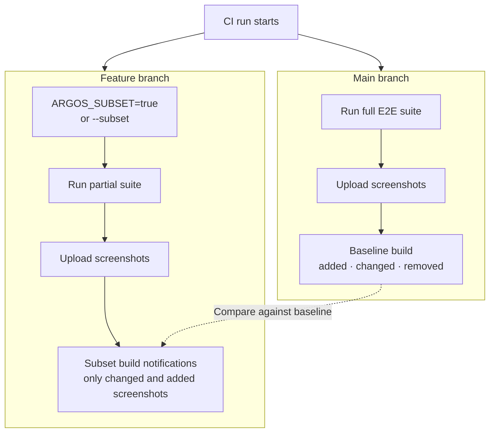

import { RunPkgCommand } from "@site/src/partials";

# Subset builds

Subset builds are designed for CI runs that **don't execute the full E2E test suite** on a branch. When a build is marked as subset, Argos **ignores removed screenshots** and only notifies you about **changed and added screenshots** from the tests you did run.

This is helpful for speeding up feature-branch validation while still getting reliable visual feedback from the relevant tests.

:::note

You still need to run your full test suite on your main branch to create and update **baseline builds**. Subset builds are not eligible as baselines. See [Baseline build](/baseline-build).

:::

## Diagram flow



## Enable subset builds

You can enable subset builds in any Argos SDK or the CLI.

### Environment variable

Set the environment variable `ARGOS_SUBSET` to `"true"` in your CI configuration.

```yml title=".github/workflows/ci.yml"
steps:
  - name: Run tests
    run: npm test
    env:
      ARGOS_SUBSET: "true"
```

### CLI

Use the `--subset` flag with the CLI.

<RunPkgCommand command="argos upload --subset ./screenshots" />

### SDK option

Most SDKs expose a `subset` option on the upload configuration.

```js title="upload.js"
import { upload } from "@argos-ci/core";

await upload({
  root: "./screenshots",
  subset: true,
});
```

## Examples

### Node.js

```js title="scripts/argos-upload.js"
import { upload } from "@argos-ci/core";

await upload({
  root: "./screenshots",
  subset: true,
});
```

### Playwright

For Playwright, simply set `ARGOS_SUBSET=true` in your CI job. The reporter will mark the build as a subset build.

```yml title=".github/workflows/ci.yml"
steps:
  - uses: actions/checkout@v4
  - uses: actions/setup-node@v4
  - run: npm ci
  - name: Run Playwright tests
    env:
      ARGOS_SUBSET: "true"
    run: npx playwright test
```

### Cypress

For Cypress, set `ARGOS_SUBSET=true` in your CI job that runs Cypress and uploads screenshots.

```yml title=".github/workflows/ci.yml"
steps:
  - uses: actions/checkout@v4
  - uses: actions/setup-node@v4
  - run: npm ci
  - name: Run Cypress tests
    env:
      ARGOS_SUBSET: "true"
    run: npx cypress run
```

## Troubleshooting / FAQ

**Why are removed screenshots ignored?**  
Subset builds only include a portion of your test suite, so missing screenshots may simply be from skipped tests, not actual deletions. Ignoring removals avoids false positives.

**Why can’t a subset build be a baseline?**  
Baselines must represent the full test suite. Subset builds are incomplete by design and would cause missing screenshots in comparisons.
