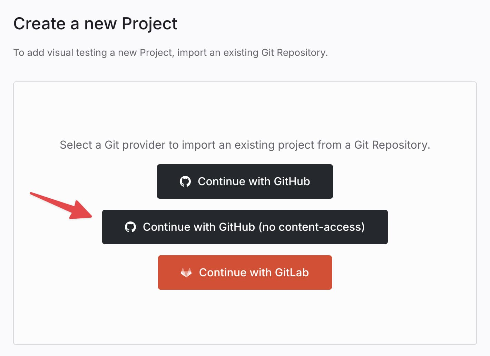

# GitHub Integration

Connect Argos to GitHub for automated visual testing on every pull request and merge queue run. Argos reads commit history to pick the right baseline build and reports results back to GitHub so you can ship with confidence.

## What Argos does on GitHub

- Add commit and pull request checks, so Argos results can block merges when required in GitHub.
- Post [pull request comments](/pull-request-comments) with the latest build results and links back to Argos.
- Analyze commit history to find the right merge base and select the correct [baseline build](/baseline-build) for visual comparisons.

## Why Argos needs repository access

Argos analyzes commit history to choose the right [baseline build](/baseline-build) and posts commit statuses or pull request comments. Granting repository access lets Argos read commits, find merge bases, and report build results back to GitHub.

## Choose your access level

- **Full access (recommended)** — Required for Merge Queue and baseline selection based on commit history.
- **Limited access (no content)** — Works for basic checks without reading repository content; Merge Queue is not supported. See [GitHub Integration without Content Permission](#github-integration-without-content-permission).

Use GitHub Connect to log in with your GitHub account, then install the Argos GitHub App to link repositories.

## Install the Argos GitHub App

Argos provides a dedicated GitHub App that connects directly to your repositories, enabling real-time visual testing feedback on pull requests.

1. Visit the [Argos app page on GitHub](https://github.com/apps/argos-ci)
2. Click on "Configure" and select the organization where you want to install Argos
3. Follow the prompts to complete the installation

### Import a GitHub repository to Argos

1. Sign in to Argos and click on "Create a new project"
2. Choose GitHub as your provider, then click "Import your repository"

### Update the Repositories Shared with Argos

1. Go to the [Argos app page on GitHub](https://github.com/apps/argos-ci) and click "Configure"
2. Select the organization where you want to manage repository access
3. Under "Repository access," choose "Only select repositories" and select the specific repositories you wish to share with Argos


## Required GitHub App permissions

Argos needs the following permissions to operate:

- **Contents** — used to find a common commit ancestor between branches
- **Statuses** — used to add statuses to commits
- **Pull requests** — used to add comments in pull requests
- **Actions** — used to allow tokenless authentication

We take your security and privacy seriously. If you have any concerns or questions, please [contact us](https://argos-ci.com/contact).

## GitHub Merge Queue support

Argos supports GitHub Merge Queue when you use the full-access Argos GitHub App. Merge Queue relies on Argos reading commit history to compute merge bases and publish required checks, so the restricted “GitHub without content access” integration does not support it. When Argos runs inside the merge queue, it compares your queued change against the previously approved commit on the target branch to ensure only clean visual changes are merged.

### GitHub Actions setup for Merge Queue

Listen to both `pull_request` and `merge_group` events so Argos uploads run for PR reviews and for queued merges:

```yaml title=".github/workflows/ci.yml"
name: Visual tests

on:
  pull_request:
  merge_group:

jobs:
  argos:
    runs-on: ubuntu-latest
    steps:
      - uses: actions/checkout@v6
      - uses: actions/setup-node@v6
      - run: npm ci
      - run: npm run test:e2e # Run E2E tests with Argos SDK integration
        env:
          ARGOS_TOKEN: ${{ secrets.ARGOS_TOKEN }} # Argos token stored in GitHub Secrets
```

## GitHub Integration without Content Permission

If you prefer to use Argos without granting full content access to your repositories, you can integrate via a more restricted setup. This mode does not support Merge Queue because Argos cannot read commit history.

### Setting Up Argos with Limited GitHub Access

1. From the dashboard, select your team from the scope selector.
2. Select the **Settings** tab and go to the **Integrations** section.
3. Scroll to "GitHub without content access".
4. Click **Install GitHub App**.


5. On GitHub, choose the specific repositories where you want to install the Argos app.


6. Back in Argos, go to the **Projects** tab.
7. Click **Create a new project** at the top right.
8. Select **Continue with GitHub (no-content access)**.



9. Choose the repository you want to connect.

## GitHub Enterprise

### GitHub Enterprise Cloud

GitHub Enterprise Cloud works out of the box. Follow the same GitHub App setup described above—no extra configuration is needed in Argos.

### GitHub Enterprise Server (self-hosted)

Self-hosted GitHub Enterprise Server deployments are supported on the Argos Enterprise plan, which also includes SAML SSO and other advanced features. To upgrade to Enterprise, [contact sales](mailto:contact@argos-ci.com).
