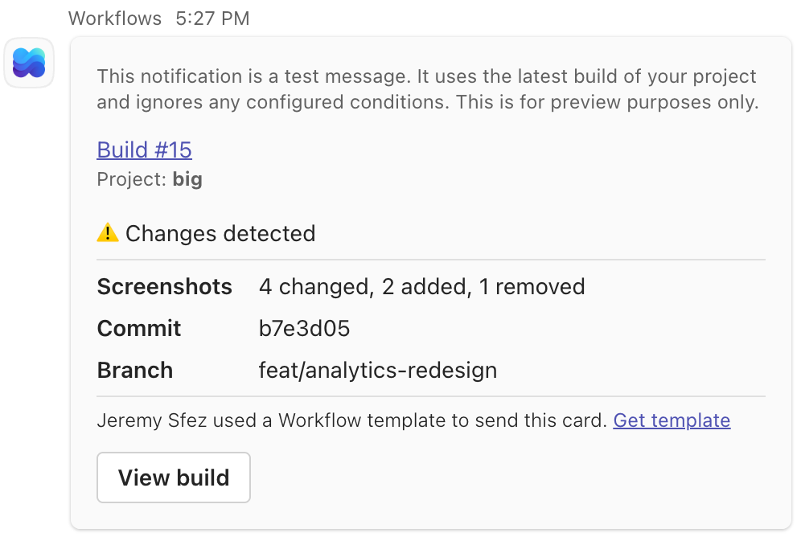
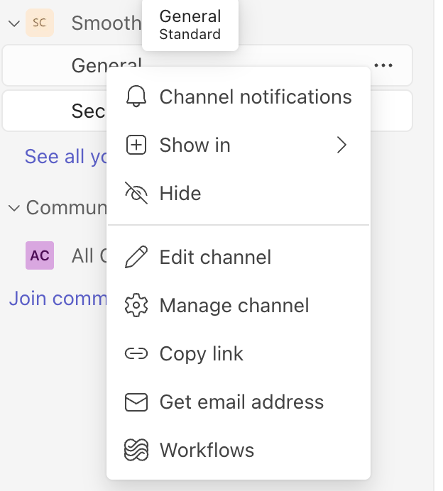
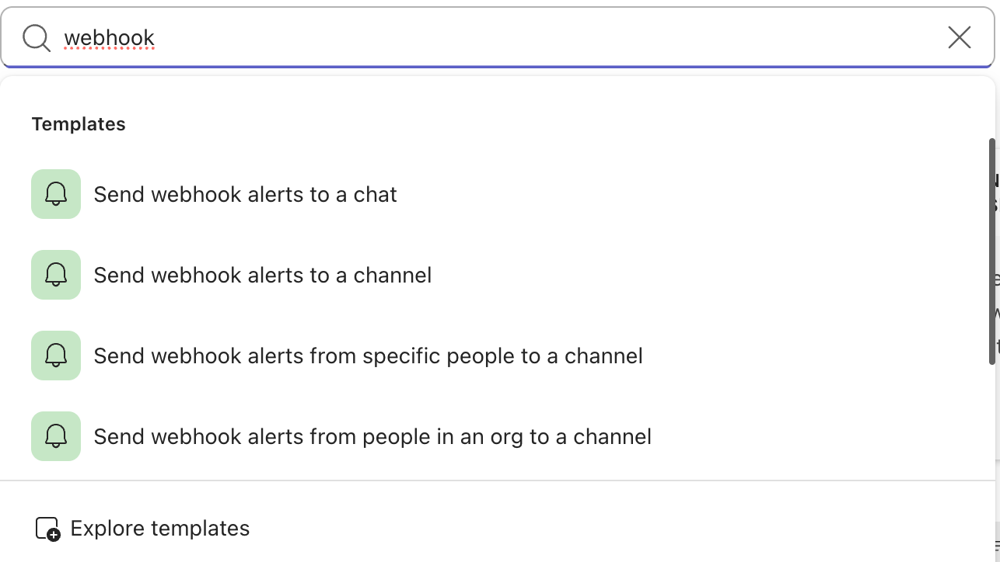

# Microsoft Teams integration

Connect Argos to Microsoft Teams to notify your team about visual changes directly in a channel.


The Microsoft Teams integration is configured at team level and is available on Pro and Enterprise plans.


### What you get

- Automatic Teams notifications when builds are created, reviewed, approved, or rejected.
- Fine-grained control over notifications using automation conditions.
- Notifications rendered as adaptive cards, with the build status, project, screenshot counts, commit, branch, and a direct link to the build.

_Example of a Microsoft Teams notification sent by Argos_

### How it works

Unlike Slack, Argos does not install an app in your Microsoft 365 tenant. You create a **Workflows** flow in Teams that listens for an incoming webhook, and paste the URL it gives you into Argos. Argos then posts adaptive cards to that URL.

This has two consequences worth knowing before you start:

- **One webhook per channel.** Each channel you want to notify needs its own flow and its own URL in Argos.
- **No URL unfurling.** Pasting an Argos build URL in Teams does not produce a build preview. The connection is outbound only, so Argos never sees messages posted in Teams.


Microsoft Teams for personal use (`teams.live.com`) does not support Workflows. You need a Microsoft 365 work or school account.


### Create the webhook in Microsoft Teams




#### Open the Workflows dialog

In Teams, hover the channel you want to notify, open its **More options** menu, and select **Workflows**.





#### Choose the right template

Search for `webhook` and select **Send webhook alerts to a channel**.


Four similar templates exist, and picking the wrong one breaks every notification. Do **not** use **Send webhook alerts from specific people to a channel** or **Send webhook alerts from people in an org to a channel**: they authenticate the caller through Microsoft Entra ID, and Argos posts server-to-server without a user identity. **Send webhook alerts to a chat** targets a chat instead of a channel.





#### Select the team and channel

Confirm the target team and channel, then select **Save**.




#### Copy the webhook URL

Once the flow is created, select **Copy webhook link** on the flow details page.

The URL looks like `https://<tenant>.<region>.environment.api.powerplatform.com/powerautomate/automations/direct/...`.




The webhook URL contains an access signature. Anyone holding it can post messages to that channel. Treat it like a secret and avoid sharing it in tickets or chat.


### Connect the channel to your team




#### Open your team integrations

From the dashboard, select your team from the scope selector, go to the team's **Settings** tab, then the **Integrations** section.




#### Add the channel

In the **Microsoft Teams** card, enter a **Name** to identify the channel in Argos, paste the **Webhook URL**, and select **Add channel**.

The name is only a label: a webhook URL never reveals which channel it points to, so pick something recognizable such as `#engineering`.




#### Send a test message

Select the send icon next to the channel to post a confirmation card. If it arrives in Teams, the connection works.



### Set up Microsoft Teams notifications

Create a notification rule with Argos automations:

1. Select a project in your Argos team.
2. Go to the **Automations** tab and select **New Automation**.
3. Name your automation, e.g., "Notify Teams on build completion".
4. Under **WHEN**, select one or several events that trigger the notification.
5. (Optional) Under **IF**, add conditions such as "Build type is check".
6. Under **THEN**, choose the action **Post in Microsoft Teams channel**. If no channel is connected yet, select **Connect Microsoft Teams** and follow the steps above.
7. Select the channel to notify.
8. Select **Send test notification** to verify the rule. A card built from your project's latest build is sent to the selected channel.
9. Select **Create Rule** to activate it.

### Troubleshooting and tips

- **"This does not look like a Microsoft Teams webhook URL".** Argos only accepts URLs served by Microsoft: `powerplatform.com`, `logic.azure.com`, and `webhook.office.com`. Copy the URL from the flow details page rather than retyping it.
- **Nothing arrives in the channel.** Check that the flow is still **Active** in Teams. Deleting or disabling the flow silently stops delivery; use the send icon in Argos to surface the error.
- **Notifications stopped after a while.** The webhook signature can be rotated or revoked on the Microsoft side. Recreate the flow and replace the URL in Argos.
- **Send test notification does nothing.** The automation form must be valid first, including the rule name.
- Only Argos team admins can add or remove channels.

Need help setting up the Microsoft Teams integration? Reach out via [Discord](https://argos-ci.com/discord) or [contact support](https://argos-ci.com/contact).
