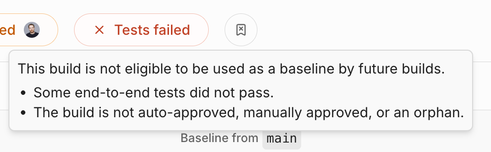
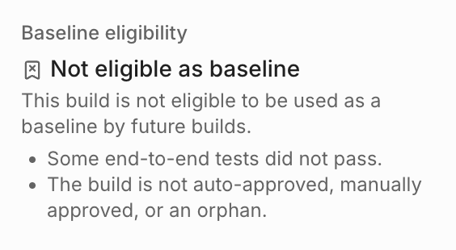

# Baseline build

A **baseline build** is the reference point Argos compares a new build against to detect visual changes. For every new build, Argos looks through the candidate builds in your project and picks the most relevant one.


This page covers CI mode, where the baseline comes from your Git history. In [Monitoring mode](build-modes.md#monitoring-mode), Argos ignores Git history and compares against the latest approved build instead.


### How Argos selects the baseline

Argos selects the baseline by finding the most recent build that satisfies two sets of criteria.

**Criteria on the candidate build itself:**

* **It is complete.** Argos has finished processing it.
* **Its tests passed.** None of the tests that produced the screenshots failed.
* **It is not a** [**subset**](../how-to-guides/ci-pipelines/subset-builds.md)**.** It uploaded the full set of snapshots.
* **It has no active rejection.** A build whose changes were rejected (and the rejection not [dismissed](../review-workflow/review-a-build.md)) can never serve as a baseline, whatever its type.
* **It is approved.** It is an auto-approved build, an [orphan](#orphan-builds), or a check build with an approved review or a merged pull request.

**Criteria relative to the new build:**

* **Same build name and mode.** Only builds with the same [build name](../how-to-guides/ci-pipelines/monorepos-setup.md) and [build mode](build-modes.md) are considered.
* **Commit ancestry.** The candidate's commit must be an ancestor of the **merge base** — the closest common commit between your branch and the baseline branch. In practice, this means the baseline reflects the code your branch actually started from.

### Check whether a build can be a baseline

Every completed build shows whether it's **eligible to become a baseline** for future builds. Look for the baseline-eligibility chip next to the build status on the build page, in the [Builds list](../review-workflow/builds-list.md), and in the build's **Info** panel:

* **Eligible as baseline** — "This build is eligible to be used as a baseline by future builds."
* **Not eligible as baseline** — "This build is not eligible to be used as a baseline by future builds."

When a build isn't eligible, the **Baseline eligibility** section of the Info panel lists which criteria it failed to meet.


The chip appears once a build is complete, and it reflects the build on its own. The comparison-dependent criteria — matching build name, mode, and commit ancestry — depend on the build being compared, so Argos evaluates them when a new build looks for its baseline.


### The baseline branch

The **baseline branch** is the branch Argos uses as the reference when resolving the merge base:

* For pull request builds, the base branch of the pull request is used.
* For push events, Argos uses the default baseline branch configured in your project.


By default, the repository's default branch is used as the baseline branch. You can change this in the Argos project settings.


### Auto-approved branches

Builds on **auto-approved branches** are approved automatically, so they can serve as baselines without a manual review. Branches are matched by pattern (e.g., `main`, `master`, or `develop`).


By default, Argos auto-approves your default baseline branch. You can configure auto-approved branch patterns in the Argos project settings.


### Configure branches in project settings

In the project settings, you can configure both the default baseline branch and the auto-approved branch patterns.

### Choose a custom baseline via SDK

To compare against a specific branch or commit instead of the automatically selected baseline, set one of these environment variables in your CI:

* `ARGOS_REFERENCE_BRANCH`: The branch to use as the baseline.
* `ARGOS_REFERENCE_COMMIT`: The commit hash to select a specific baseline build.

### Orphan builds

An **orphan build** is a build for which Argos found no baseline to compare against. This is expected for a project's first builds: once a build on your baseline branch is approved (or auto-approved), subsequent builds find their baseline automatically.
