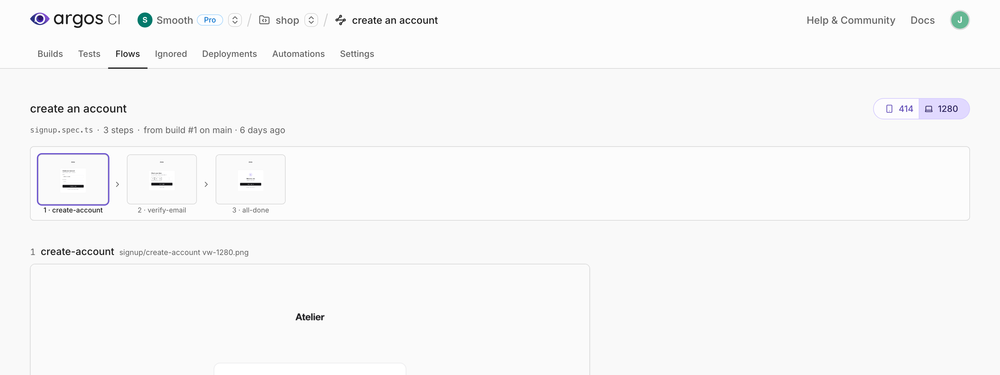
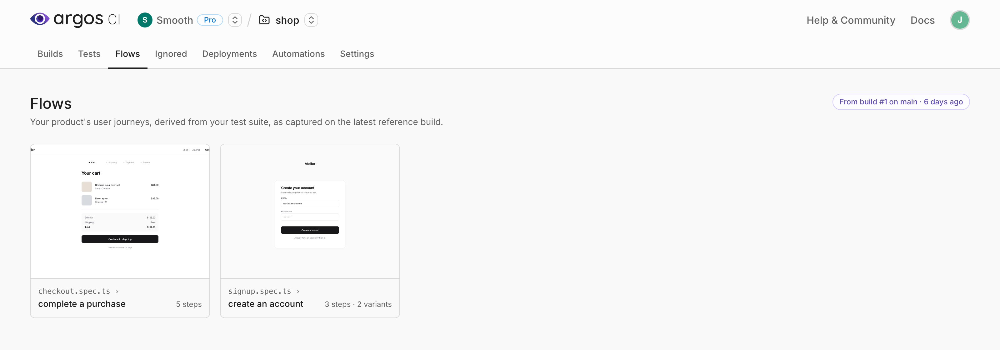
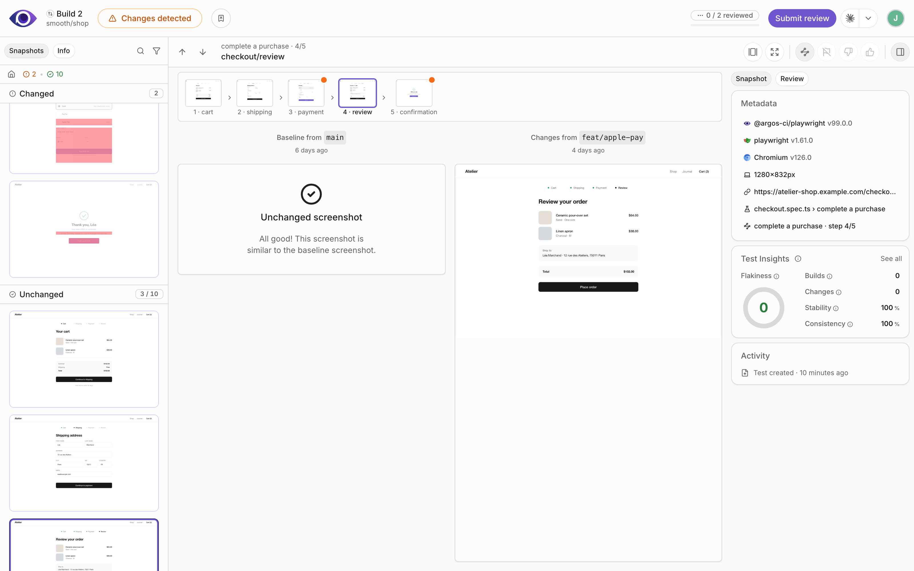

# Flows

A checkout, a signup, an onboarding: your tests already walk through these journeys and capture a screenshot at each step. Argos groups those screenshots back into **flows** — the journey in the order the user lives it — so you review a change with the screen before and after it in sight.

Flows are derived from the structure of your test suite. There is nothing to install and no option to set.

### How Argos derives a flow

Every screenshot carries the metadata your Argos SDK records, and Argos uses it to decide which journey the screenshot belongs to:

* **Test frameworks** (Playwright, Cypress, Vitest) — the test's title path is the flow: the file, the `describe` blocks, and the test name. Every screenshot that test captures is a step of that flow.
* **Storybook** — the component is the flow, and each of its stories is a step.

A test that captures a single screenshot is not a journey — that's regular visual testing — so it doesn't appear as a flow.


Flows rely on the test metadata the SDK records. The Puppeteer and WebdriverIO SDKs don't report a test title path, so their screenshots don't group into flows.


#### Steps and variants

A **step** is a logical screen, not a file. The viewport, browser, color scheme, and Storybook mode variants of the same screen collapse into one step, exactly as they do in the review. A journey captured at three viewports in light and dark mode is one flow of the same steps in six variants — not six flows.

The same applies to a suite you run twice for theming: `Checkout` and `Checkout (dark)` are one flow whose steps have a light and a dark variant.

#### Step order

Steps are ordered by **capture order**: each screenshot records its position within its test, so the journey reads in the order your test walked it. Screenshots taken before that recording existed — or by an SDK that doesn't report it — fall back to **alphabetical** by name.

The order of a flow is therefore the order of your test. To change it, change the test.

### Browse your flows

1. Open your project in Argos.
2. Select the **Flows** tab.

Each card shows the first step of a journey, its name, how many steps it has, and how many variants each step comes in. Flows are computed from the **latest reference build**, so the gallery reflects the state of your main branch rather than a work in progress.

### Read a flow

Select a card to open the flow. The journey runs top to bottom, one screenshot per step, at full size.

* **The filmstrip** at the top keeps every step in sight while you scroll and follows along as you move down the page. Select a thumbnail to jump to that step.
* **Variants** — one button group per axis that actually varies in the flow: browser, viewport, color scheme, and Storybook mode. Switch an axis and the whole journey re-renders in that variant, so you can walk the flow as a mobile user or in dark mode.
* **Select a step** to open it in its build, with the baseline, the changes, and the diff.

### Flows in the review

A build that captured a journey is reviewed as one:

* **Journey order** — within each section of the screenshot list, the screenshots of a flow are ordered by journey rather than alphabetically, so you review the cart before the confirmation.
* **Flow context** — the flow name and your position in it appear above the screenshot name.
* **Flow minimap** — a toolbar toggle shows the whole journey as a strip of thumbnails under the screenshot, marking the steps that need attention.
* **Open the flow** — the flow chip in the **Metadata** panel of the sidebar links to the flow view.

| Shortcut  | Action                              |
| --------- | ----------------------------------- |
| `⇧` + `←` | Go to the previous step of the flow |
| `⇧` + `→` | Go to the next step of the flow     |

Press `?` on a build page for the full list of shortcuts, and see [Review a build](review-a-build.md) for the rest of the review workflow.

### Get better flows

Flows work without setup, but a few habits make them read better:

* **One journey per test.** A test that walks a user from the cart to the confirmation makes a flow; a test that screenshots ten unrelated pages makes a list.
* **Name the test after the journey.** The test name is the flow name, so `complete a purchase` reads better than `checkout spec` — and renaming the test is how you rename the flow.
* **Name each screenshot after the screen** it captures. Those names become the step labels.
