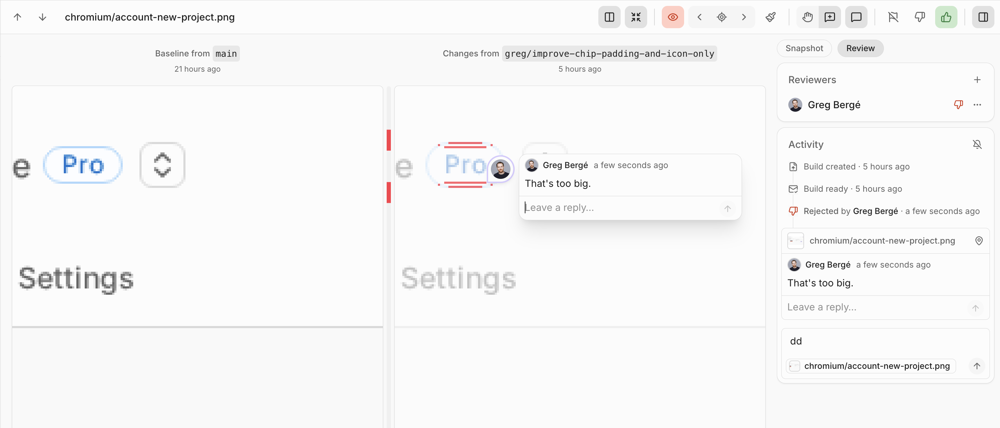
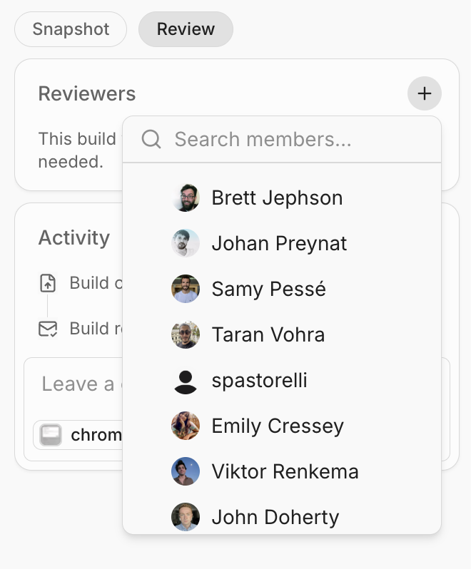
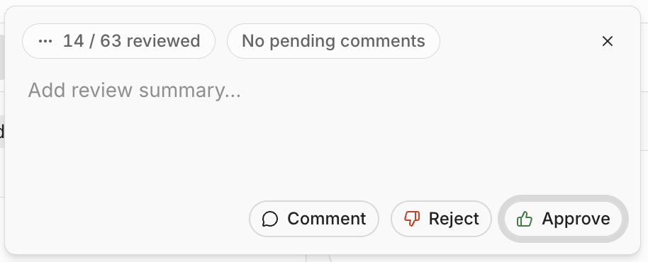
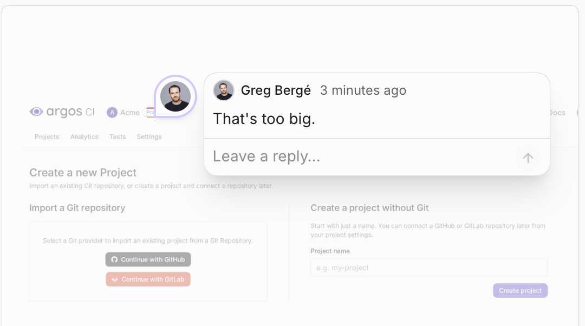
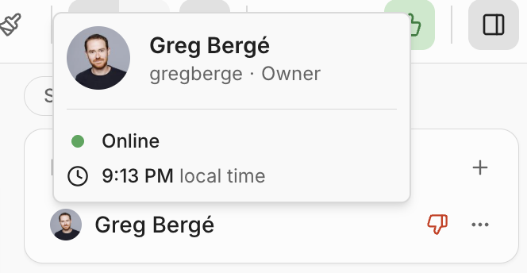
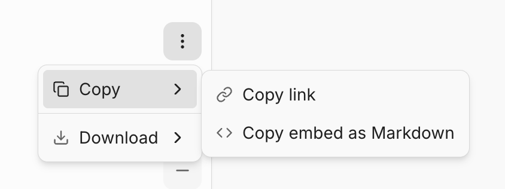

# Review a build

When a build detects visual changes, the build page is where your team decides what to do with them. Reviewing a build is collaborative: request the people you need, leave comments pinned to exactly what changed, discuss in threads, and approve or reject — with everything updating in real time.

Every reviewer's decision counts on its own, so a build reflects your whole team's input rather than just the last person to weigh in.

### Open a build

You can open a build from several places:

* The [Builds list](builds-list.md) in your project.
* The [pull request comment](pull-request-comments.md) Argos posts on your PR.
* The [Argos status check](summary-checks.md) on your commit or pull request.

The build page shows each screenshot with its **baseline** (the reference) next to the **changes** (the new screenshot), and highlights the visual diff between them. See [How Argos detects visual differences](../platform-fundamentals/how-argos-detects-visual-differences.md) for how the diff is computed, and use [Tags](tags.md) to filter the screenshot list down to what you care about.

### Request reviewers

Use the **Reviewers** section in the build sidebar to request the people you want to weigh in.

1. In the **Reviewers** section, click the **+** button (**Add reviewer**).
2. Search for and select one or more project members.

You can request several reviewers, add or remove them at any time, and each reviewer's verdict is tracked **individually** — a new review never overwrites someone else's.

Each reviewer shows one of the following states:

| State         | Meaning                                                       |
| ------------- | ------------------------------------------------------------- |
| **Approved**  | The reviewer approved the changes.                            |
| **Rejected**  | The reviewer rejected the changes.                            |
| **Commented** | The reviewer left feedback without approving or rejecting.    |
| **Pending**   | The reviewer was requested but hasn't reviewed yet.           |
| **Dismissed** | The review was dismissed and no longer counts.                |

#### How reviews decide the build status

Only each reviewer's **latest** review counts, and dismissed reviews are ignored. The build status follows two rules:

* **One rejection blocks.** If any reviewer's latest review is a rejection, the build is **rejected** — even if others approved.
* **Otherwise, one approval passes.** With no active rejection, a single approval marks the build **approved**.

Comment reviews and pending requests don't affect the outcome. To unblock a rejected build, the rejecting reviewer can submit a new review, or an administrator can dismiss the rejection.

### Submit a review

Open the review popover from the build header and choose one of three actions:

* **Comment** — submit feedback without approving or rejecting.
* **Reject** — reject the changes.
* **Approve** — approve the changes so the build can be merged.

Add an optional summary in the **Add review summary…** field, written in Markdown. A summary is **required** when you submit a neutral **Comment** review.

As you work through a build, a review-progress chip (for example, **2 / 3 reviewed**) tracks how many changes you've reviewed so far.

#### Draft reviews

You don't have to publish each comment as you go. By default, the comments you add while reviewing are gathered into a **pending review** that stays private to you — each shows a **Pending** badge noting "Only you can see this. It becomes visible when you submit your review." When you submit, all of them are published at once and your reviewers are notified together — GitHub-style.

To post a single comment immediately instead of adding it to your pending review, hold **Alt** while submitting (**Post comment**).

Your in-progress comments are saved locally, so you won't lose a thought if you navigate away before submitting.

### Comment on exactly what changed

Comments are pinned to precisely what they're about:

* On a screenshot, click a point to **pin the comment to that exact spot**.
* In a text-based snapshot, select a **line or a range of lines** to attach the comment to those lines.

The snapshot you're viewing is automatically attached to your comment, and you can detach or reattach it without losing what you've written.

Comments are written in **Markdown** and support:

* **`/` slash commands** for quick formatting.
* **@mentions** to notify a teammate.

### Discuss in threads

Any comment can become a conversation:

* **Reply** to a comment to start a thread.
* **React** with emoji — open the **Add reaction** menu on a comment and pick one.
* **Resolve** a thread once the discussion is settled, and **reopen** it if it comes back up.

### Collaborate in real time

Everything on the build page updates live — comments, replies, reactions, resolutions, and review decisions appear as they happen, with no refresh.

**Presence dots** show who else is on the build and whether they're online, and each teammate's user card shows their role and current local time, so you know who's around before you wait on a review.

Review notifications arrive as a single digest rather than one message per action. To control your own notifications for a build, use the subscribe toggle in the **Activity** section of the sidebar.

### Reference a screenshot

Each screenshot pane has a **⋮** actions menu — on both the **baseline** and the **changes** — that makes it easy to reference a screenshot in a pull request or share it with a teammate:

* **Copy link** — copy a direct link to the screenshot.
* **Copy embed as Markdown** — copy the screenshot as a Markdown image embed, ready to paste into a PR description or comment.
* **Download** — download the screenshot. For a changed screenshot you can also download the **diff mask** and the **composed changes** (the diff overlaid on the screenshot).

### Who can review

* Leaving reviews and comments requires a role that can review builds — team **Owners** and **Members**, or **Contributors** assigned the **Project Reviewer** or **Project Administrator** role. The build must also be in a reviewable state (changes detected, approved, or rejected).
* Dismissing another person's review requires an administrator-level role.

See [Team members & roles](../account-and-access/team-members-and-roles.md) for the full permission breakdown.

### Review from the API

Every review and comment action is also available in the [Argos REST API](https://argos-ci.com/docs/api-reference): submit, list, and dismiss reviews; create, read, update, and delete comments and replies; add and remove reactions; and resolve or reopen threads. Because these actions are attributed to a user and checked against that user's project permissions, they require a **personal access token** rather than a project token.

You can also submit reviews from the [Argos CLI](../../sdks-reference/argos-command-line-interface-cli.md#review-create) with `argos review create`, or let an [AI agent review builds](review-builds-with-ai-agents.md) for you.
