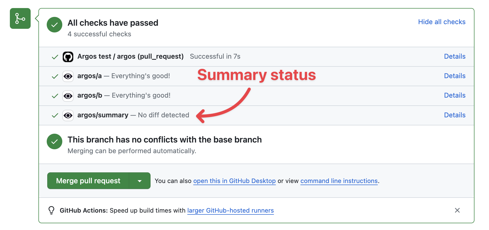
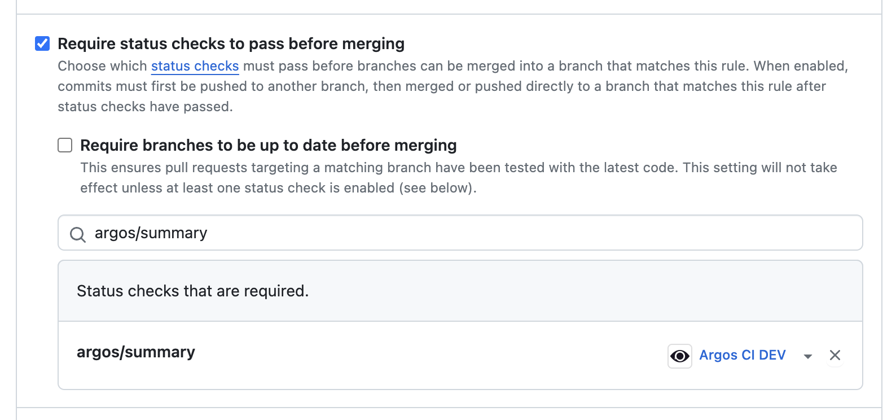

# Summary checks

Argos Summary Checks: Simplify merge decisions with a unified view of commit statuses, enhancing your workflow with configurable, insightful checks.

They are particularly useful to [setup required status checks before merging](https://docs.github.com/en/repositories/configuring-branches-and-merges-in-your-repository/managing-protected-branches/about-protected-branches#require-status-checks-before-merging) a pull request.

## Options for Summary Checks

There are three configurations for summary checks:

1. **Add a summary check only if there is more than one build**:
   - This is recommended for most projects. It adds a summary check to help you quickly see the combined status of multiple builds.

2. **Always add a summary check**:
   - This option is useful if your project conditionally runs builds, such as Argos builds. It ensures that you the summary status check will always be present.

3. **Never add a summary check**:
   - Select this if you wish to disable summary checks. This might be preferred if summary checks are not providing additional value to your project's workflow.

Remember, summary checks are an additional layer of status reporting and do not replace individual check statuses.

## Configuring Summary Checks

To configure summary checks for your project, follow these steps:

1. Navigate to the project settings in Argos.
2. Locate the 'Summary Checks' section.
3. Choose the appropriate option based on your project's needs.
4. Click `Save` to apply the changes.

